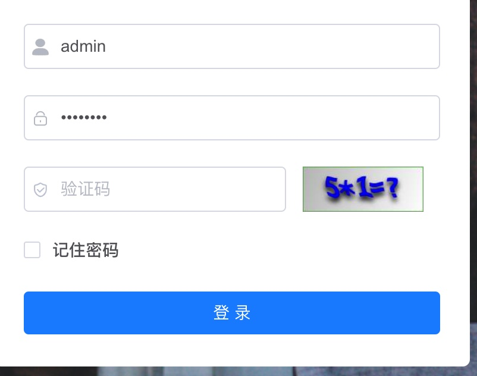
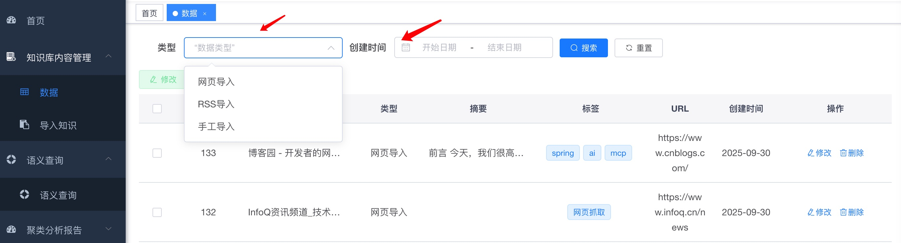
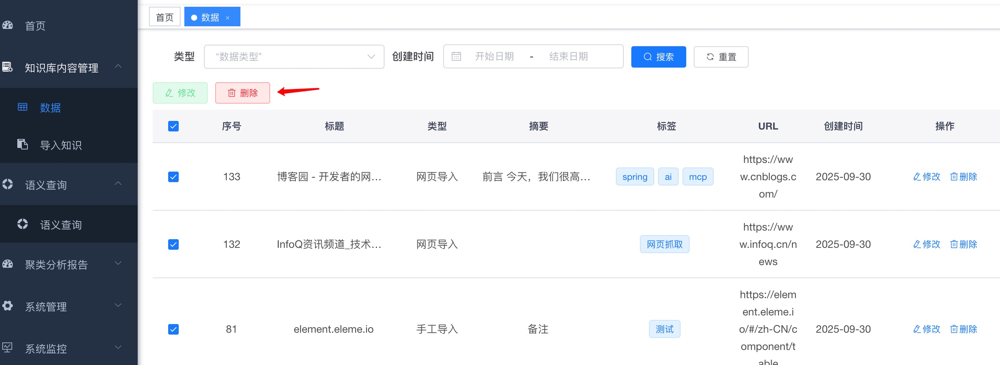
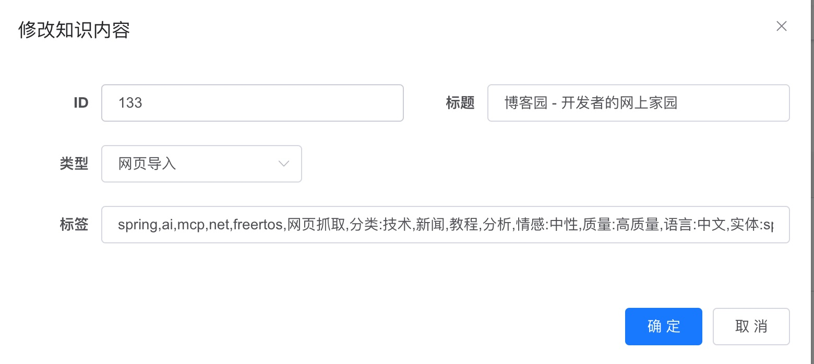
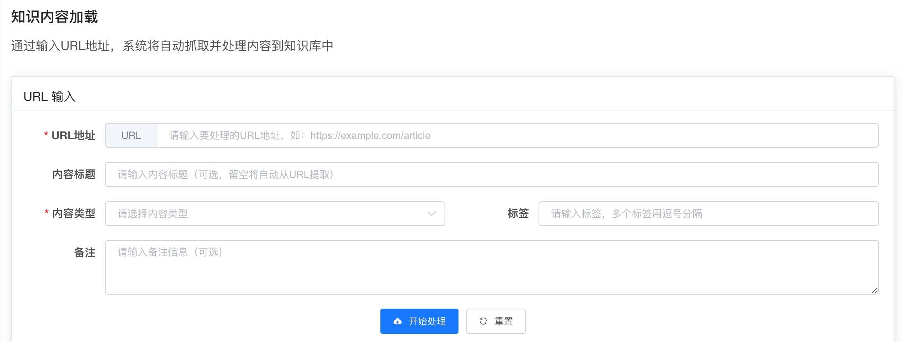
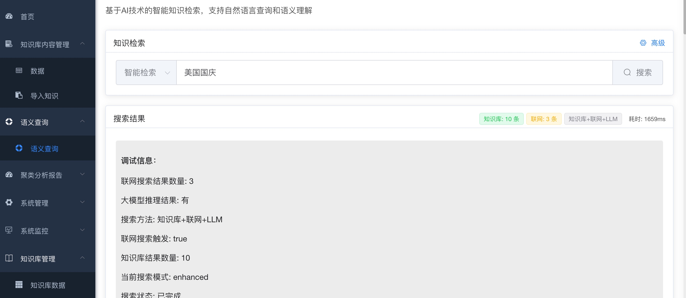
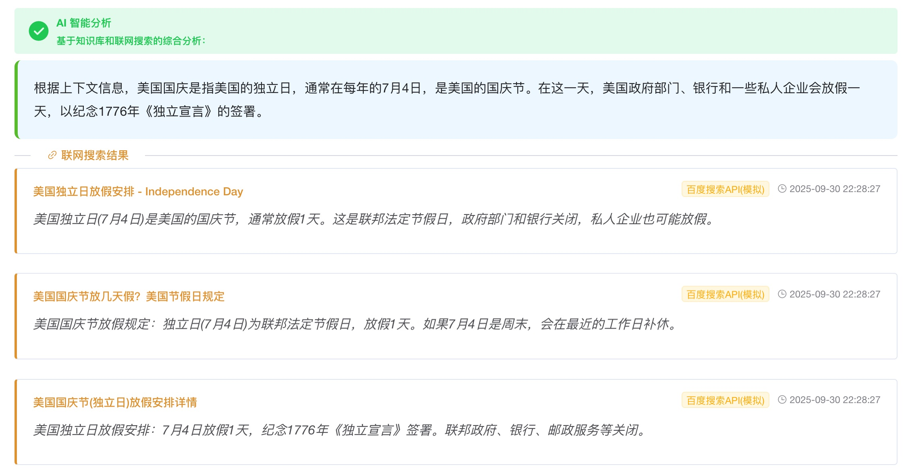
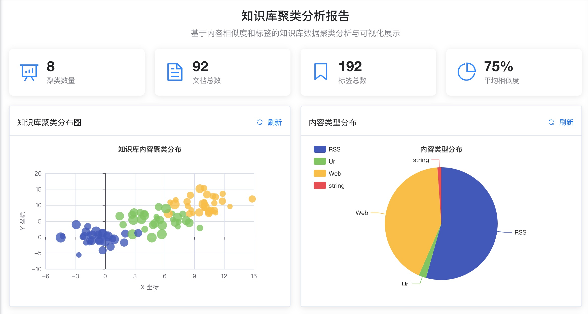
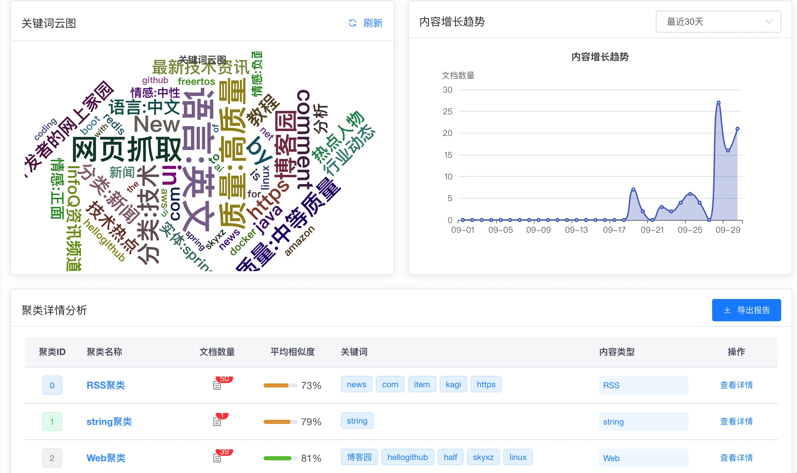

# HA72 Intelligent Knowledge Retrieval System

## Project Overview

HA72 is an intelligent knowledge retrieval system based on Spring Boot + Vue.js, integrating LangChain4j framework and large language models, providing intelligent Q&A, semantic search, and online query functionality.

### Core Features

- **Basic Knowledge Retrieval**: Fast retrieval based on FAISS vector database
- **Enhanced Knowledge Retrieval**: Semantic search based on LangChain4j + OpenAI
- **Online Query**: Automatically triggers Baidu search when knowledge base results are insufficient
- **Large Model Inference**: Intelligent analysis combining knowledge base and online results
- **Email Notification**: Supports email notification functionality after successful import

## Technical Architecture

### Backend Technology Stack

- **Spring Boot 3.2.0**: Main framework
- **LangChain4j**: Large language model integration framework
- **OpenAI API**: GPT-3.5-turbo model
- **FAISS**: Vector database (in-memory version)
- **Maven**: Dependency management
- **Java 21**: Development language

### Frontend Technology Stack

- **Vue.js 2.x**: Frontend framework
- **Element UI**: UI component library
- **Axios**: HTTP client
- **Node.js**: Runtime environment

## Project Structure

```
HA72/
├── backend/                    # Backend projects
│   ├── langchain/              # LangChain intelligent retrieval service, with two approaches: LangChain4j+OpenAI and cosine similarity
│   │   ├── src/main/java/      # Java source code
│   │   ├── src/main/resources/ # Configuration files
│   │   └── pom.xml             # Maven configuration
│   └── todo-backend/           # Data collection through RSS and web scraping, stored in MySQL database, providing API interfaces
├── management/                 # Management system project
│   └── ruoyi-ui/               # Vue.js frontend, management backend responsible for login control and frontend menu interface control
├── prototype/                  # Project prototype
└── README.md                   # Project documentation
```

## Environment Requirements

### System Requirements

- **Java**: JDK 21+
- **Node.js**: 14.x+
- **Maven**: 3.6+
- **Memory**: At least 4GB RAM
- **Storage**: At least 2GB available space

### External Dependencies

- **OpenAI API Key**: For large language model calls
- **SMTP Server**: For email notifications (optional)

## Quick Start

### 1. Clone Project

```bash
git clone https://github.com/scott20050218/XU-News-AI-RAG/
cd XU-News-AI-RAG
```

### 2. Configure Environment Variables

Create environment variable file or set system environment variables:

```bash
# OpenAI Configuration
export OPENAI_API_KEY="your-openai-api-key"
export OPENAI_BASE_URL="https://api.openai.com/v1"

# Email Configuration (Optional)
export MAIL_USERNAME="your-email@gmail.com"
export MAIL_PASSWORD="your-app-password"
export MAIL_FROM="noreply@ha72.com"

# Baidu Search Configuration (Optional)
export BAIDU_API_KEY="your-baidu-api-key"
export BAIDU_SECRET_KEY="your-baidu-secret-key"
```

### 3. Start Backend Services

#### Start Main Business System (Port 18080)

Use scripts in management/sql directory to initialize database
Database configuration in /management/src/main/resources/application-druid.yml

```bash
cd management
mvn clean package
Start redis
java -jar ruoyi-admin/target/ruoyi-admin.jar
```

#### Start LangChain Intelligent Retrieval Service (Port 8090)

```bash
cd backend/langchain
export OPENAI_API_KEY="your-openai-api-key"
export OPENAI_BASE_URL="https://api.openai.com/v1"
export MAIL_USERNAME="your-email@gmail.com"
export MAIL_PASSWORD="your-app-password"
export MAIL_FROM="noreply@ha72.com"
export BAIDU_API_KEY="your-baidu-api-key"
export BAIDU_SECRET_KEY="your-baidu-secret-key"
mvn clean package
mvn spring-boot:run
```

#### Start Data Collection Service (Port 8080)

Use todo-backend/db.sql script to initialize database
Database configuration in /backend/todo-backend/src/main/resources/application-druid.yml

```bash
cd backend/todo-backend
mvn clean package
mvn spring-boot:run
```

### 4. Start Frontend Service

```bash
cd management/ruoyi-ui
npm install
npm run dev
```

Frontend service will start at `http://localhost:1024`.

## Detailed Configuration

### Backend Configuration

#### LangChain Service Configuration (`backend/langchain/src/main/resources/application.properties`)

```properties
# Service Port
server.port=8090

# OpenAI Configuration
openai.api-key=${OPENAI_API_KEY:your-openai-api-key}
openai.base-url=${OPENAI_BASE_URL:https://api.openai.com/v1}
openai.chat-model=gpt-3.5-turbo
openai.embedding-model=text-embedding-ada-002

# Email Configuration
spring.mail.host=smtp.gmail.com
spring.mail.port=587
spring.mail.username=${MAIL_USERNAME:your-email@gmail.com}
spring.mail.password=${MAIL_PASSWORD:your-app-password}
spring.mail.properties.mail.smtp.auth=true
spring.mail.properties.mail.smtp.starttls.enable=true

# Online Search Configuration
web.search.enabled=true
web.search.baidu.api-key=${BAIDU_API_KEY:}
web.search.baidu.secret-key=${BAIDU_SECRET_KEY:}
web.search.timeout=5000
web.search.max-results=3
```

### Frontend Configuration

#### Proxy Configuration (`management/ruoyi-ui/vue.config.js`)

```javascript
module.exports = {
  devServer: {
    proxy: {
      // LangChain API Proxy
      "/dev-api/langchain": {
        target: "http://localhost:8090",
        changeOrigin: true,
        pathRewrite: {
          "^/dev-api/langchain": "",
        },
      },
      // Main System API Proxy
      "/dev-api/api/knowledge-content": {
        target: "http://localhost:8080",
        changeOrigin: true,
        pathRewrite: {
          "^/dev-api": "",
        },
      },
    },
  },
};
```

## Feature Requirements

1. Implement scheduled task mechanism to acquire news information through RSS, web scraping, and intelligent agent tools (must comply with web crawler standards and security guidelines)

- Implementation Description

```
 @Scheduled(fixedRate = 3600000) // Execute every 1 hour (3600000 milliseconds)
    public void acquireRssData() {
        log.info("Starting RSS data collection...");
        int successCount = 0;  // Number of successfully collected items
        int failureCount = 0;  // Number of failed RSS sources
```

```
 private static final List<String> WEB_URLS = List.of(
            "https://www.infoq.cn/news",    // InfoQ news channel
            "https://www.cnblogs.com/"      // Blog garden homepage
    );
```

2. Deploy large models based on Ollama, recommend using qwen2.5::3b model.

- Implementation Description
  Based on OpenAI API implementation, model uses GPT-3.5-turbo"

3. Build local knowledge base system, configure embedding model (recommend using all-MiniLM-L6-v2), reranking model (recommend using ms-marco-MiniLM-L-6-v2) and large language model

- Implementation Description
  Embedding model all-MiniLM-L6-v2, vector dimension: 384 dimensions
  Reranking model LLM inference GPT-3.5-turbo, reasoning and optimization through large language model

4. Write scraped information to knowledge base system through API, supporting structured data (can be organized through Excel) and unstructured data types.

- Implementation Description
  Write scraped information to knowledge base system through API

5. After successful information storage, automatically send email notifications (title and content customizable).

- Implementation Description
  After successful information storage, send emails through Gmail.
  (Test environment is in Germany, 163 does not allow overseas IP to use authorization codes, Hotmail email sending failed)

6. Provide user login functionality.

- Implementation Description
  Use Ruoyi framework to implement user permission control
  

7. After login, support knowledge base content management: view data list (filterable by type/time), execute single or batch delete operations, edit metadata (such as tags, sources), and support uploading various types of data to knowledge base through the page.

- Implementation Description
  
  
  
  

8. After login, provide semantic query functionality: prioritize searching knowledge base content based on user questions, return results sorted by similarity.

- Implementation Description
  
  
  

9. If knowledge base does not match relevant data, automatically trigger online query (such as calling Baidu search API), return top 3 results after large language model reasoning.

- Implementation Description

```
// 2. Determine if online query is needed
            boolean needWebSearch = shouldTriggerWebSearch(knowledgeResponse, request);
            List<WebSearchResultDto> webSearchResults = new ArrayList<>();
            long webSearchTime = 0L;
            log.info("needWebSearch: {}", needWebSearch);
            if (needWebSearch) {
                log.info("Insufficient knowledge base search results, triggering online query: query={}", request.getQuery());

                // 3. Execute online query
                long webSearchStart = System.currentTimeMillis();
                List<WebSearchService.WebSearchResult> webResults =
                    webSearchService.searchBaidu(request.getQuery(), 3);
```

10. After login, provide knowledge base data clustering analysis report, showing Top 10 keyword distribution

- Implementation Description
  
  

## Technical Requirements

1. Technology stack selection: Frontend adopts React or Vue framework, backend adopts SpringBoot or Flask framework, relational database uses MySQL or SQLite, vector database uses FAISS.

- Implementation Description
  Technology stack selection: Frontend adopts Vue framework, backend adopts SpringBoot framework, relational database uses MySQL, vector database uses FAISS.

2. Data storage design: Metadata (such as data ID, data type, etc.) stored in relational database, vector data separately stored in FAISS vector database, implementing data classification management and efficient retrieval.

- Implementation Description
  Data storage design: Metadata (such as data ID, data type, etc.) stored in relational database, vector data separately stored in FAISS vector database, implementing data classification management and efficient retrieval.

3. Framework integration: Core business logic development adopts LangChain framework, supporting knowledge base construction and retrieval enhancement functionality.

- Implementation Description
  Framework integration: Core business logic development adopts LangChain framework, supporting knowledge base construction and retrieval enhancement functionality.

4. Model invocation: Implement interaction with large model services through standardized API interfaces, ensuring service call standardization and extensibility.

- Implementation Description
  Model invocation: Implement interaction with large model services through standardized API interfaces, ensuring service call standardization and extensibility.

5. Identity authentication: Login functionality prioritizes Spring Security framework or JWT technical solution, ensuring security and reliability of user identity verification.

- Implementation Description
  Identity authentication: Login functionality prioritizes Spring Security framework, ensuring security and reliability of user identity verification.

## Other Requirements

1. Project material submission requirements: Upload all project-related materials to GitHub repository, repository named "xu-ai-news-rag".

- Implementation Description
  GitHub repository, https://github.com/scott20050218/XU-News-AI-RAG/

2. Need to provide Product Requirements Document (PRD).

- Implementation Description
  ./product_requirements_document.md

3. Need to provide overview design document and technical architecture document

- Implementation Description
  ./design_document.md

4. Need to provide product prototype design files.

- Implementation Description
  /prototype/my-app
  Documentation: /prototype/my-app/README.md, /prototype/my-app/project_description_document.md

5. Need to provide complete frontend and backend code.

- Implementation Description
  Frontend code: /management/ruoyi-ui
  Backend code: /backend/todo-backend, /backend/langchain, /management

6. Need to provide unit tests, integration tests and API test related code.

- Implementation Description
  /backend/todo-backend, run mvn test
  /backend/langchain, run mvn test

7. If the project involves relational database operations, need to provide corresponding SQL statements.

- Implementation Description
  /backend/todo-backend/src/main/resources/sql
  /management/ruoyi-ui/src/main/resources/sql

8. Need to provide project description document (README.md), clearly stating project deployment, operation and usage methods.

- Implementation Description
  Refer to this README.md and README.md files in each project

9. Optional: Prepare project introduction document for technical sharing.

- Implementation Description
  Refer to log.md record.md

## API Interface Documentation

### Enhanced Search Interface

**Interface Address**: `POST /api/enhanced-knowledge/enhanced-search`

**Request Parameters**:

```json
{
  "query": "How many days off for German National Day",
  "topK": 5
}
```

**Response Example**:

```json
{
  "code": 200,
  "data": {
    "query": "How many days off for German National Day",
    "knowledgeResults": [...],
    "webSearchResults": [
      {
        "title": "German National Day Holiday Arrangement - Latest Official Information 2025",
        "url": "https://www.baidu.com/link?url=example1",
        "snippet": "German National Day (Unity Day) is October 3rd, this is a legal holiday in Germany, usually 1 day off.",
        "source": "Baidu Search API (Simulated)"
      }
    ],
    "llmInference": "Based on knowledge base and online search results...",
    "webSearchTriggered": true,
    "searchMethod": "Knowledge Base + Online + LLM",
    "totalProcessingTimeMs": 28
  }
}
```

### Other Interfaces

- **Basic Knowledge Retrieval**: `POST /api/enhanced-knowledge/search`
- **Intelligent Q&A**: `POST /api/enhanced-knowledge/ask`
- **Knowledge Content Management**: `GET /api/knowledge-content`

## User Guide

### 1. Knowledge Base Management

1. Visit `http://localhost:1024`
2. Login to system (default account: admin/admin123)
3. Enter "Knowledge Management" → "Knowledge Content"
4. Add, edit or delete knowledge content

### 2. Intelligent Search

1. Enter "Knowledge Retrieval" page
2. Select search mode:
   - **Basic Search**: Quick retrieval of knowledge base content
   - **Enhanced Search**: Semantic search + online query + AI analysis
   - **Intelligent Q&A**: Direct conversation with AI
3. Input query content, click search

### 3. Online Query Functionality

The system will automatically determine whether online query is needed:

- Insufficient knowledge base results
- Low search result similarity
- User query involves latest information

Online query will call Baidu search API and integrate results for AI analysis.

## Deployment Instructions

### Development Environment Deployment

Follow the steps in the "Quick Start" section for deployment.

### Production Environment Deployment

#### Backend Deployment

1. **Compile and Package**:

```bash
cd backend/langchain
mvn clean package -DskipTests
```

2. **Run JAR Package**:

```bash
java -jar target/langchain-0.0.1-SNAPSHOT.jar
```

#### Frontend Deployment

1. **Build Production Version**:

```bash
cd management/ruoyi-ui
npm run build
```

2. **Deploy to Web Server**:
   Deploy files in `dist` directory to Nginx or Apache server.

#### Nginx Configuration Example

```nginx
server {
    listen 80;
    server_name your-domain.com;

    # Frontend static files
    location / {
        root /path/to/ruoyi-ui/dist;
        try_files $uri $uri/ /index.html;
    }

    # API proxy
    location /dev-api/langchain/ {
        proxy_pass http://localhost:8090/;
        proxy_set_header Host $host;
        proxy_set_header X-Real-IP $remote_addr;
    }

    location /dev-api/ {
        proxy_pass http://localhost:8080/;
        proxy_set_header Host $host;
        proxy_set_header X-Real-IP $remote_addr;
    }
}
```

## Troubleshooting

### Common Issues

#### 1. OpenAI API Call Failure

**Symptoms**: API call failure prompt when searching
**Solution**:

- Check if `OPENAI_API_KEY` environment variable is correctly set
- Confirm API Key has sufficient quota
- Check if network connection is normal

#### 2. Frontend 404 Error

**Symptoms**: Frontend calling API returns 404
**Solution**:

- Confirm backend service is running (port 8090)
- Check proxy configuration in `vue.config.js`
- Confirm API path configuration is correct

#### 3. Email Sending Failure

**Symptoms**: Email notification functionality not working
**Solution**:

- Check SMTP server configuration
- Confirm email authorization code is correct
- Check network firewall settings

#### 4. Online Query Not Working

**Symptoms**: Online query not triggered when searching
**Solution**:

- Check `web.search.enabled` configuration
- Confirm Baidu API key configuration (optional, system has simulation mode)
- Adjust online query trigger threshold

### Log Viewing

#### Backend Logs

```bash
# LangChain service logs
tail -f backend/langchain/logs/langchain-ai-service.log

# Main system logs
tail -f backend/ruoyi/logs/sys-info.log
```

#### Frontend Logs

View frontend logs in the Console panel of browser developer tools.

## Performance Optimization

### Backend Optimization

1. **JVM Parameter Tuning**:

```bash
java -Xms2g -Xmx4g -XX:+UseG1GC -jar langchain-0.0.1-SNAPSHOT.jar
```

2. **Database Connection Pool Configuration**:

```properties
spring.datasource.hikari.maximum-pool-size=20
spring.datasource.hikari.minimum-idle=5
```

### Frontend Optimization

1. **Code Splitting**: Use route lazy loading
2. **Resource Compression**: Enable Gzip compression
3. **Cache Strategy**: Configure static resource caching

## Development Guide

### Adding New Search Sources

1. Add new search methods in `WebSearchService`
2. Update search logic in `EnhancedKnowledgeSearchService`
3. Add corresponding configuration items

### Customizing AI Models

1. Modify model configuration in `LangChainService`
2. Update model parameters in `application.properties`
3. Restart service

### Extending Knowledge Base

1. Add new content in knowledge management page
2. System will automatically vectorize and add to search index
3. Support batch import functionality

## Contribution Guide

1. Fork this project
2. Create feature branch: `git checkout -b feature/new-feature`
3. Commit changes: `git commit -am 'Add new feature'`
4. Push branch: `git push origin feature/new-feature`
5. Create Pull Request

## License

This project is licensed under the MIT License. See the [LICENSE](LICENSE) file for details.

## Contact Information

- **Project Maintainer**: HA72 Team
- **Email**: support@ha72.com
- **Documentation**: https://docs.ha72.com

## Changelog

### v1.0.0 (2025-09-30)

- ✅ Basic knowledge retrieval functionality
- ✅ Enhanced semantic search
- ✅ Online query integration
- ✅ Large model inference
- ✅ Email notification functionality
- ✅ Complete web interface

---

**Note**: Please ensure to carefully read and understand all configuration items before using in production environment, and perform corresponding security configuration according to actual needs.
