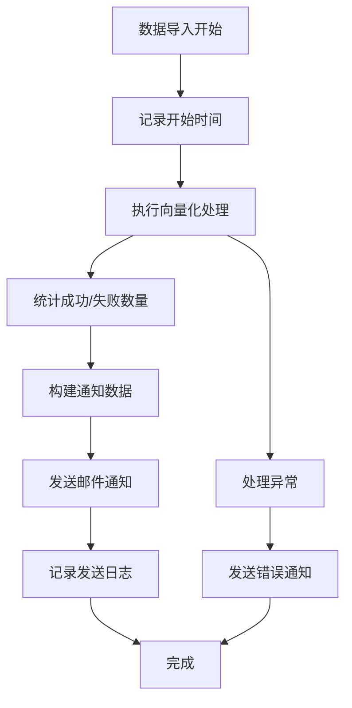

# LangChain 邮件通知功能说明

## 📧 功能概述

在 langchain 项目的基础检索系统中添加了**自动邮件通知功能**，当信息入库成功后，系统会自动发送邮件通知到指定邮箱：`13888528521@163.com`。

## 🎯 通知场景

邮件通知会在以下情况下自动触发：

1. **全量数据导入完成**
2. **分页数据导入完成**
3. **按类型数据导入完成**
4. **按标签数据导入完成**
5. **单个数据导入完成**

## 📋 邮件内容格式

**邮件标题**：`信息入库成功`

**邮件内容包含**：

- 📅 导入时间：具体的导入完成时间
- ✅ 成功导入数量：成功处理的数据条数
- ❌ 失败导入数量：处理失败的数据条数
- 📊 总计数量：本次处理的总数据量
- ⏱️ 处理耗时：整个导入过程的用时
- 📈 成功率：导入成功的百分比
- 🔄 导入类型：全量/分页/按类型等
- 📋 系统信息：服务状态和配置信息

## ⚙️ 配置说明

### 1. 环境变量配置

需要设置以下环境变量：

```bash
# 邮件发送账号配置
export MAIL_USERNAME=your-email@163.com
export MAIL_PASSWORD=your-app-password
export MAIL_FROM=noreply@ha72.com
```

### 2. application.properties 配置

```properties
# 邮件服务器配置
spring.mail.host=smtp.163.com
spring.mail.port=587
spring.mail.username=${MAIL_USERNAME:your-email@163.com}
spring.mail.password=${MAIL_PASSWORD:your-app-password}
spring.mail.properties.mail.smtp.auth=true
spring.mail.properties.mail.smtp.starttls.enable=true
spring.mail.properties.mail.smtp.starttls.required=true
spring.mail.properties.mail.smtp.ssl.trust=smtp.163.com

# 邮件通知配置
app.notification.email.from=${MAIL_FROM:noreply@ha72.com}
app.notification.email.to=13888528521@163.com
app.notification.email.enabled=true
```

### 3. 163 邮箱配置步骤

1. **登录 163 邮箱**
2. **开启 SMTP 服务**：
   - 进入邮箱设置 → POP3/SMTP/IMAP
   - 开启 SMTP 服务
3. **获取授权码**：
   - 设置客户端授权密码
   - 记录生成的授权码（不是登录密码）
4. **更新环境变量**：
   ```bash
   export MAIL_USERNAME=your-real-email@163.com
   export MAIL_PASSWORD=your-authorization-code
   ```

## 🚀 使用方法

### 1. 自动触发

正常进行数据导入操作时，邮件通知会自动发送：

```bash
# 触发全量导入
curl -X POST http://localhost:8090/api/vectorization/process-all

# 触发分页导入
curl -X POST http://localhost:8090/api/vectorization/process-page?page=0&size=10

# 触发按类型导入
curl -X POST http://localhost:8090/api/vectorization/process-by-type?contentType=RSS
```

### 2. 测试邮件功能

```bash
# 发送测试邮件
curl -X POST http://localhost:8090/api/email/test

# 获取邮件配置
curl -X GET http://localhost:8090/api/email/config
```

## 📊 邮件模板预览

邮件采用精美的 HTML 模板，包含：

- **响应式设计**：支持桌面和移动端
- **数据可视化**：进度条显示成功率
- **状态指示**：绿色/黄色/红色表示成功/警告/失败
- **详细统计**：完整的导入统计信息
- **品牌标识**：HA72 系统标识和样式

### 邮件样例

```
📊 信息入库成功通知
HA72 智能知识管理系统 - langchain-ai-service

📈 导入统计信息
━━━━━━━━━━━━━━━━━━━━━━━━━━━━━━━━━━━━━━━━
📅 导入时间    2025-09-30 14:30:00
✅ 成功导入    25 条
❌ 失败导入    0 条
📊 总计处理    25 条
⏱️ 处理耗时    2500 毫秒
📈 成功率      100.00%
🔄 导入类型    全量导入

🎉 导入状态：成功
本次信息导入已成功完成，数据已存储到向量数据库中，可用于智能检索服务。

🔗 系统信息
服务名称：langchain-ai-service
向量化引擎：FAISS + AllMiniLmL6V2
检索引擎：LangChain4j + 基础检索系统
```

## 🔧 技术实现

### 核心组件

1. **ImportNotificationDto**：邮件通知数据模型
2. **EmailNotificationService**：邮件发送服务
3. **VectorizationProcessorService**：集成邮件通知的向量化处理服务
4. **EmailTestController**：邮件测试接口

### 发送流程



## 🛠️ 故障排除

### 常见问题

1. **邮件发送失败**

   - 检查网络连接
   - 验证 163 邮箱配置
   - 确认授权码正确

2. **模板渲染错误**

   - 检查 Thymeleaf 依赖
   - 验证模板文件路径
   - 降级到简单文本格式

3. **SMTP 连接超时**
   - 检查防火墙设置
   - 确认 SMTP 端口可访问
   - 验证 SSL/TLS 配置

### 日志查看

```bash
# 查看邮件发送日志
tail -f logs/langchain.log | grep -i "email\|mail"

# 查看详细错误信息
tail -f logs/langchain.log | grep -i "error.*notification"
```

## 📈 监控建议

1. **邮件发送成功率监控**
2. **通知延迟监控**
3. **邮件模板渲染性能**
4. **SMTP 连接池状态**

## 🔮 未来扩展

1. **多收件人支持**
2. **邮件模板自定义**
3. **短信通知集成**
4. **微信/钉钉机器人通知**
5. **通知规则配置化**

---

**开发团队**：HA72 开发团队  
**更新时间**：2025 年 9 月 30 日  
**版本**：v1.0

