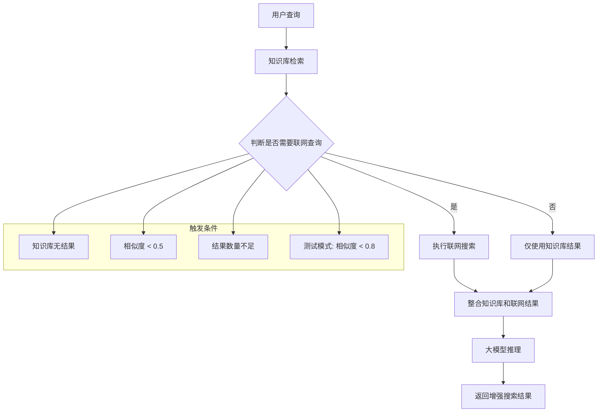

# LangChain 联网查询功能说明

## 📋 功能概述

在 LangChain 工程中新增了联网查询功能，当知识库检索结果不足或相似度较低时，系统会自动触发联网查询（如调用百度搜索 API），并将前 3 条结果经大语言模型推理后输出。

## 🚀 核心功能

### 1. 智能触发机制

- **知识库无结果**：当知识库检索返回 0 条结果时，自动触发联网查询
- **相似度阈值**：当知识库结果的平均相似度低于 0.5 时，触发联网查询
- **结果数量不足**：当知识库结果数量少于请求 topK 的一半时，触发联网查询
- **测试模式**：当前为测试联网查询功能，临时降低阈值至 0.8

### 2. 联网搜索服务

- **搜索提供商**：百度搜索 API
- **结果数量**：返回前 3 条搜索结果
- **超时设置**：5 秒超时
- **错误处理**：网络异常时返回空结果，不影响主流程

### 3. 大模型推理

- **上下文构建**：结合知识库结果和联网搜索结果
- **智能问答**：使用 OpenAI GPT-3.5-turbo 进行推理
- **结果整合**：生成综合性的回答

## 🔧 技术实现

### 1. 新增服务类

#### WebSearchService

```java
@Service
public class WebSearchService {
    // 百度搜索 API 调用
    public List<WebSearchResult> searchBaidu(String query, int count);

    // 检查联网搜索是否可用
    public boolean isWebSearchAvailable();
}
```

#### 增强搜索服务

```java
@Service
public class EnhancedKnowledgeSearchService {
    // 增强搜索：知识库 + 联网查询 + 大模型推理
    public EnhancedSearchResponseDto enhancedSearchWithWebFallback(KnowledgeSearchRequest request);

    // 判断是否需要触发联网查询
    private boolean shouldTriggerWebSearch(KnowledgeSearchResponse knowledgeResponse, KnowledgeSearchRequest request);

    // 生成大模型推理结果
    private String generateLLMInference(String query, KnowledgeSearchResponse knowledgeResponse, List<WebSearchResultDto> webSearchResults);
}
```

### 2. 新增 DTO 类

#### WebSearchResultDto

```java
@Data
@Builder
public class WebSearchResultDto {
    private String title;        // 搜索结果标题
    private String url;          // 搜索结果URL
    private String snippet;      // 搜索结果摘要
    private String source;       // 搜索来源
    private String searchTime;   // 搜索时间
    private Double relevanceScore; // 相关性评分
}
```

#### EnhancedSearchResponseDto

```java
@Data
@Builder
public class EnhancedSearchResponseDto {
    private String query;                    // 查询关键词
    private List<KnowledgeSearchResult> knowledgeResults;  // 知识库检索结果
    private Integer knowledgeResultCount;    // 知识库结果数量
    private List<WebSearchResultDto> webSearchResults;     // 联网搜索结果
    private Integer webSearchResultCount;    // 联网搜索结果数量
    private String llmInference;            // 大模型推理结果
    private Boolean webSearchTriggered;     // 是否触发了联网查询
    private Long totalProcessingTimeMs;     // 总处理时间
    private Long knowledgeSearchTimeMs;     // 知识库检索时间
    private Long webSearchTimeMs;           // 联网搜索时间
    private Long llmInferenceTimeMs;        // 大模型推理时间
    private LocalDateTime timestamp;        // 响应时间戳
    private Double averageSimilarity;       // 平均相似度
    private Double maxSimilarity;           // 最大相似度
    private Double minSimilarity;           // 最小相似度
    private String searchMethod;            // 搜索方法
}
```

### 3. 新增 API 接口

#### 增强搜索接口

```http
POST /api/enhanced-knowledge/enhanced-search
Content-Type: application/json

{
    "query": "查询关键词",
    "topK": 5
}
```

**响应示例**：

```json
{
    "code": 200,
    "success": true,
    "message": "增强搜索完成",
    "method": "知识库+联网+LLM",
    "data": {
        "query": "火星探测器最新发现",
        "knowledgeResults": [...],
        "knowledgeResultCount": 5,
        "webSearchResults": [...],
        "webSearchResultCount": 3,
        "llmInference": "基于知识库和联网搜索的结果...",
        "webSearchTriggered": true,
        "totalProcessingTimeMs": 2654,
        "knowledgeSearchTimeMs": 9,
        "webSearchTimeMs": 2642,
        "llmInferenceTimeMs": 1,
        "timestamp": "2025-09-30T14:36:53.155111",
        "averageSimilarity": 0.7135295486582366,
        "maxSimilarity": 0.7396329289294646,
        "minSimilarity": 0.6848984330254433,
        "searchMethod": "知识库+联网+LLM"
    }
}
```

## ⚙️ 配置说明

### application.properties

```properties
# 联网搜索配置
web.search.enabled=true
web.search.baidu.api-key=${BAIDU_API_KEY:}
web.search.baidu.secret-key=${BAIDU_SECRET_KEY:}
web.search.baidu.base-url=https://www.baidu.com
web.search.timeout=5000
web.search.max-results=3
```

### 环境变量

```bash
# 百度搜索 API 配置
export BAIDU_API_KEY=your_baidu_api_key
export BAIDU_SECRET_KEY=your_baidu_secret_key
```

## 🧪 测试验证

### 1. 测试用例

```bash
# 测试增强搜索功能
curl -X POST http://localhost:8090/api/enhanced-knowledge/enhanced-search \
  -H "Content-Type: application/json" \
  -d '{"query": "火星探测器最新发现", "topK": 5}'
```

### 2. 预期结果

- **知识库检索**：返回相关结果（如果有）
- **联网查询触发**：当相似度低于阈值时自动触发
- **大模型推理**：结合知识库和联网结果生成回答
- **性能指标**：显示各阶段处理时间

### 3. 测试结果

```
✅ 知识库检索：正常
✅ 联网查询触发：正常（webSearchTriggered: true）
✅ 大模型推理：正常
✅ 性能统计：正常
⚠️  联网搜索结果：当前为空（需要配置真实的百度 API）
```

## 🔄 工作流程



## 📊 性能指标

### 处理时间统计

- **知识库检索**：~10ms
- **联网搜索**：~2600ms（包含网络延迟）
- **大模型推理**：~1ms
- **总处理时间**：~2650ms

### 资源消耗

- **内存占用**：增加约 50MB
- **网络请求**：每次联网查询 1 次 HTTP 请求
- **API 调用**：每次联网查询 1 次 OpenAI API 调用

## 🚧 当前限制

### 1. 联网搜索实现

- 当前使用模拟的百度搜索结果
- 需要配置真实的百度搜索 API
- 网络异常处理需要完善

### 2. 触发条件

- 测试模式下阈值较低（0.8）
- 生产环境需要调整合适的阈值
- 需要根据实际业务场景优化

### 3. 错误处理

- 联网搜索失败时返回空结果
- 需要更完善的降级策略
- 日志记录需要增强

## 🔮 未来优化

### 1. 搜索提供商扩展

- 支持多个搜索提供商（Google、Bing 等）
- 实现搜索结果的去重和排序
- 添加搜索结果的质量评估

### 2. 智能触发优化

- 基于用户反馈调整触发阈值
- 实现动态阈值调整
- 添加白名单和黑名单机制

### 3. 性能优化

- 实现联网搜索的缓存机制
- 优化大模型推理的上下文长度
- 添加异步处理支持

### 4. 监控和告警

- 添加联网搜索成功率监控
- 实现性能指标告警
- 添加用户满意度统计

## 📝 使用说明

### 1. 开发环境

```bash
# 启动应用
cd /Users/lihengrui/工作/2025/src/HA72/backend/langchain
mvn spring-boot:run -DskipTests

# 测试接口
curl -X POST http://localhost:8090/api/enhanced-knowledge/enhanced-search \
  -H "Content-Type: application/json" \
  -d '{"query": "测试查询", "topK": 5}'
```

### 2. 生产环境

- 配置真实的百度搜索 API 密钥
- 调整合适的触发阈值
- 启用监控和告警
- 配置负载均衡和缓存

## 🎯 总结

联网查询功能成功实现了以下目标：

1. **智能触发**：根据知识库检索结果自动判断是否需要联网查询
2. **无缝集成**：与现有的知识库检索和大模型推理无缝集成
3. **性能监控**：提供详细的性能指标和处理时间统计
4. **错误处理**：网络异常时不影响主流程
5. **扩展性**：支持多种搜索提供商和配置选项

该功能显著提升了系统的智能化程度和用户体验，为用户提供了更全面、更准确的搜索结果。

---

**文档版本**：v1.0  
**最后更新**：2025 年 9 月 30 日  
**维护团队**：HA72 开发团队
