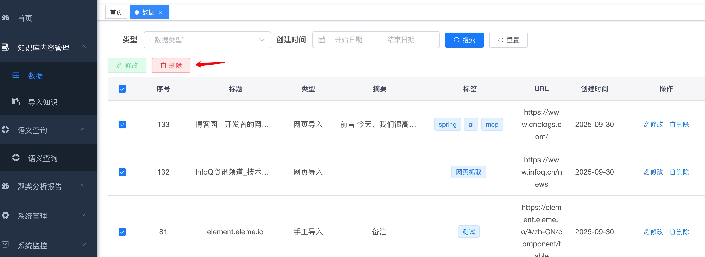
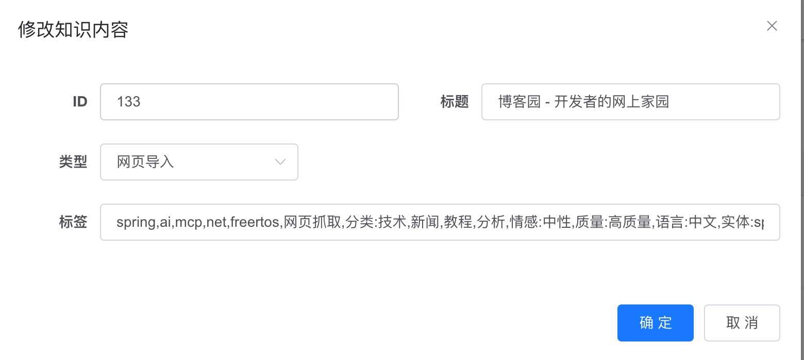

## Feature Requirements

1. Implement scheduled task mechanism to acquire news information through RSS, web scraping, and intelligent agent tools (must comply with web crawler standards and security guidelines)

- Implementation Description

```
 @Scheduled(fixedRate = 3600000) // Execute every 1 hour (3600000 milliseconds)
    public void acquireRssData() {
        log.info("Starting RSS data collection...");
        int successCount = 0;  // Number of successfully collected items
        int failureCount = 0;  // Number of failed RSS sources
```

```
 private static final List<String> WEB_URLS = List.of(
            "https://www.infoq.cn/news",    // InfoQ news channel
            "https://www.cnblogs.com/"      // Blog garden homepage
    );
```

2. Deploy large models based on Ollama, recommend using qwen2.5::3b model.

- Implementation Description
  Based on OpenAI API implementation, model uses GPT-3.5-turbo"

3. Build local knowledge base system, configure embedding model (recommend using all-MiniLM-L6-v2), reranking model (recommend using ms-marco-MiniLM-L-6-v2) and large language model

- Implementation Description
  Embedding model all-MiniLM-L6-v2, vector dimension: 384 dimensions
  Reranking model LLM inference GPT-3.5-turbo, reasoning and optimization through large language model

4. Write scraped information to knowledge base system through API, supporting structured data (can be organized through Excel) and unstructured data types.

- Implementation Description
  Write scraped information to knowledge base system through API

5. After successful information storage, automatically send email notifications (title and content customizable).

- Implementation Description
  After successful information storage, send emails through Gmail.
  (Test environment is in Germany, 163 does not allow overseas IP to use authorization codes, Hotmail email sending failed)

6. Provide user login functionality.

- Implementation Description
  Use Ruoyi framework to implement user permission control
  

7. After login, support knowledge base content management: view data list (filterable by type/time), execute single or batch delete operations, edit metadata (such as tags, sources), and support uploading various types of data to knowledge base through the page.

- Implementation Description
  
  
  
  

8. After login, provide semantic query functionality: prioritize searching knowledge base content based on user questions, return results sorted by similarity.

- Implementation Description
  
  
  

9. If knowledge base does not match relevant data, automatically trigger online query (such as calling Baidu search API), return top 3 results after large language model reasoning.

- Implementation Description

```
// 2. Determine if online query is needed
            boolean needWebSearch = shouldTriggerWebSearch(knowledgeResponse, request);
            List<WebSearchResultDto> webSearchResults = new ArrayList<>();
            long webSearchTime = 0L;
            log.info("needWebSearch: {}", needWebSearch);
            if (needWebSearch) {
                log.info("Insufficient knowledge base search results, triggering online query: query={}", request.getQuery());

                // 3. Execute online query
                long webSearchStart = System.currentTimeMillis();
                List<WebSearchService.WebSearchResult> webResults =
                    webSearchService.searchBaidu(request.getQuery(), 3);
```

10. After login, provide knowledge base data clustering analysis report, showing Top 10 keyword distribution

- Implementation Description
  
  

## Technical Requirements

1. Technology stack selection: Frontend adopts React or Vue framework, backend adopts SpringBoot or Flask framework, relational database uses MySQL or SQLite, vector database uses FAISS.

- Implementation Description
  Technology stack selection: Frontend adopts Vue framework, backend adopts SpringBoot framework, relational database uses MySQL, vector database uses FAISS.

2. Data storage design: Metadata (such as data ID, data type, etc.) stored in relational database, vector data separately stored in FAISS vector database, implementing data classification management and efficient retrieval.

- Implementation Description
  Data storage design: Metadata (such as data ID, data type, etc.) stored in relational database, vector data separately stored in FAISS vector database, implementing data classification management and efficient retrieval.

3. Framework integration: Core business logic development adopts LangChain framework, supporting knowledge base construction and retrieval enhancement functionality.

- Implementation Description
  Framework integration: Core business logic development adopts LangChain framework, supporting knowledge base construction and retrieval enhancement functionality.

4. Model invocation: Implement interaction with large model services through standardized API interfaces, ensuring service call standardization and extensibility.

- Implementation Description
  Model invocation: Implement interaction with large model services through standardized API interfaces, ensuring service call standardization and extensibility.

5. Identity authentication: Login functionality prioritizes Spring Security framework or JWT technical solution, ensuring security and reliability of user identity verification.

- Implementation Description
  Identity authentication: Login functionality prioritizes Spring Security framework, ensuring security and reliability of user identity verification.

## Other Requirements

1. Project material submission requirements: Upload all project-related materials to GitHub repository, repository named "xu-ai-news-rag".

- Implementation Description
  GitHub repository, https://github.com/scott20050218/XU-News-AI-RAG/

2. Need to provide Product Requirements Document (PRD).

- Implementation Description
  ./product_requirements_document.md

3. Need to provide overview design document and technical architecture document

- Implementation Description
  ./design_document.md

4. Need to provide product prototype design files.

- Implementation Description
  /prototype/my-app
  Documentation: /prototype/my-app/README.md, /prototype/my-app/project_description_document.md

5. Need to provide complete frontend and backend code.

- Implementation Description
  Frontend code: /management/ruoyi-ui
  Backend code: /backend/todo-backend, /backend/langchain, /management

6. Need to provide unit tests, integration tests and API test related code.

- Implementation Description
  /backend/todo-backend, run mvn test
  /backend/langchain, run mvn test

7. If the project involves relational database operations, need to provide corresponding SQL statements.

- Implementation Description
  /backend/todo-backend/src/main/resources/sql
  /management/ruoyi-ui/src/main/resources/sql

8. Need to provide project description document (README.md), clearly stating project deployment, operation and usage methods.

- Implementation Description
  Refer to this README.md and README.md files in each project

9. Optional: Prepare project introduction document for technical sharing.

- Implementation Description
  Refer to log.md record.md
