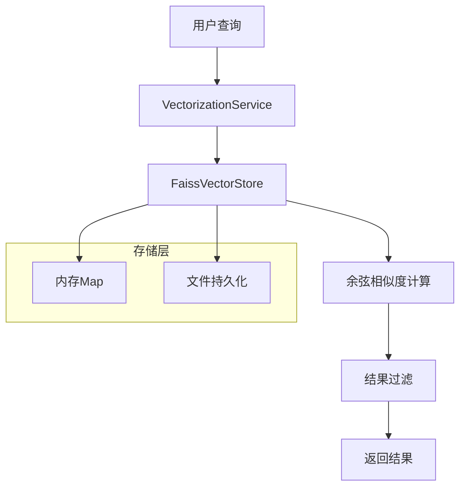
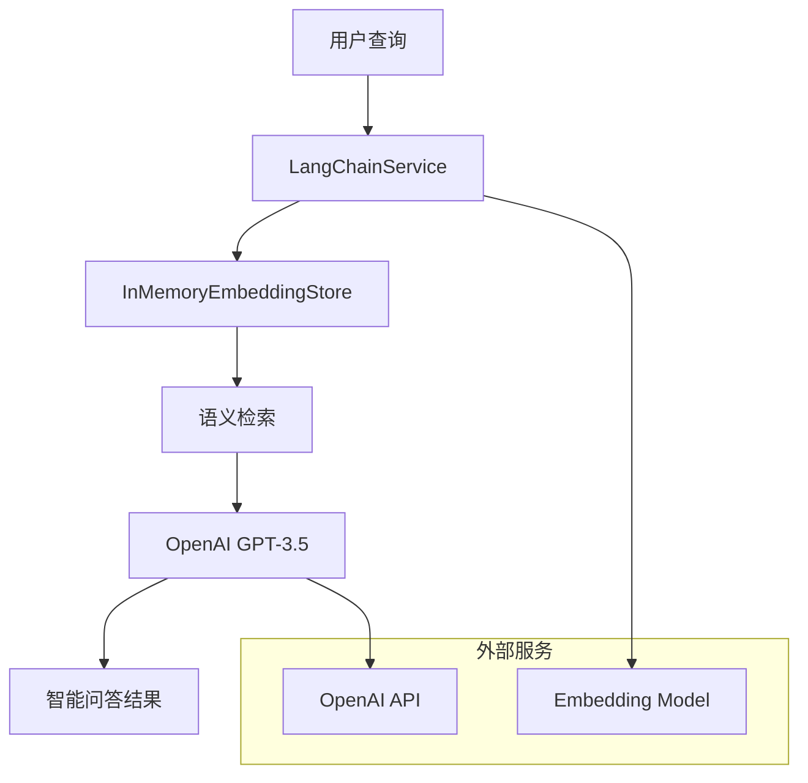

# LangChain 工程中两种知识检索实现方式对比

## 📋 概述

LangChain 工程中实现了两种不同的知识检索方式，分别针对不同的使用场景和需求。本文档详细对比这两种实现方式的技术架构、功能特性、优缺点等。

## 🔍 1. 基础知识检索服务 (KnowledgeSearchService)

### 1.1 实现方式

- **向量存储**：自研的 FAISS 向量存储 (`FaissVectorStore`)
- **向量化**：使用 `VectorizationService` + AllMiniLmL6V2 模型
- **检索算法**：基于余弦相似度的向量检索
- **存储方式**：内存存储 + 文件持久化

### 1.2 核心功能

```java
// 主要方法
public KnowledgeSearchResponse searchKnowledge(KnowledgeSearchRequest request)
```

### 1.3 技术栈

- **向量化模型**：AllMiniLmL6V2 (384 维)
- **向量存储**：内存 Map + 文件持久化
- **相似度计算**：余弦相似度
- **过滤机制**：内容类型、处理状态等

### 1.4 优点

1. **轻量级**：无外部依赖，部署简单
2. **高性能**：内存检索，响应速度快
3. **离线运行**：不依赖外部服务
4. **易维护**：代码结构简单，易于理解和修改
5. **资源占用低**：内存和 CPU 消耗较小

### 1.5 缺点

1. **功能相对简单**：只提供基础的向量检索
2. **无大模型支持**：无法进行智能问答
3. **语义理解有限**：基于向量相似度，语义理解能力有限
4. **扩展性受限**：功能扩展需要大量自定义开发
5. **缺少高级特性**：无对话、上下文理解等高级功能

---

## 🚀 2. 增强知识检索服务 (EnhancedKnowledgeSearchService)

### 2.1 实现方式

- **向量存储**：LangChain4j 框架的 `InMemoryEmbeddingStore`
- **向量化**：LangChain4j + AllMiniLmL6V2 模型
- **检索算法**：LangChain4j 的语义检索
- **大模型集成**：OpenAI GPT-3.5-turbo

### 2.2 核心功能

```java
// 主要方法
public KnowledgeSearchResponse searchKnowledgeWithLangChain(KnowledgeSearchRequest request)
public String askQuestionWithLLM(String question)
public int processKnowledgeContentForLangChain(int page, int size)
```

### 2.3 技术栈

- **框架**：LangChain4j
- **向量化模型**：AllMiniLmL6V2 + OpenAI Embedding
- **大模型**：OpenAI GPT-3.5-turbo
- **向量存储**：LangChain4j 内存存储

### 2.4 优点

1. **智能检索**：基于 LangChain4j 的语义检索能力
2. **大模型支持**：集成 OpenAI GPT-3.5-turbo 进行智能问答
3. **功能丰富**：支持对话、上下文理解等高级功能
4. **扩展性强**：基于成熟框架，易于扩展新功能
5. **智能化程度高**：能够理解复杂查询意图

### 2.5 缺点

1. **外部依赖**：依赖 OpenAI API，需要网络连接
2. **成本较高**：使用 OpenAI API 需要付费
3. **网络要求**：需要稳定的网络连接
4. **资源消耗大**：内存和 CPU 消耗相对较高
5. **配置复杂**：需要配置 API 密钥等参数

---

## 📊 3. 详细对比表

| 对比维度       | 基础检索服务   | 增强检索服务           |
| -------------- | -------------- | ---------------------- |
| **向量存储**   | 自研 FAISS     | LangChain4j            |
| **向量化模型** | AllMiniLmL6V2  | AllMiniLmL6V2 + OpenAI |
| **检索算法**   | 余弦相似度     | LangChain4j 语义检索   |
| **大模型支持** | 无             | OpenAI GPT-3.5-turbo   |
| **问答功能**   | 无             | 有                     |
| **外部依赖**   | 无             | OpenAI API             |
| **网络要求**   | 无             | 需要                   |
| **成本**       | 低             | 高                     |
| **性能**       | 快             | 中等                   |
| **功能丰富度** | 基础           | 丰富                   |
| **扩展性**     | 有限           | 强                     |
| **维护复杂度** | 低             | 高                     |
| **部署难度**   | 简单           | 中等                   |
| **适用场景**   | 离线、简单检索 | 在线、智能问答         |

---

## 🎯 4. 使用场景建议

### 4.1 基础检索服务适用场景

- **离线环境**：无法连接外部服务的环境
- **成本敏感**：对成本有严格要求的项目
- **简单检索**：只需要基础向量检索功能
- **快速原型**：需要快速搭建原型系统
- **资源受限**：服务器资源有限的环境

### 4.2 增强检索服务适用场景

- **智能问答**：需要智能问答功能的场景
- **复杂检索**：需要复杂语义检索的场景
- **生产环境**：对功能要求较高的生产环境
- **用户体验**：注重用户体验的应用
- **大模型集成**：需要大模型能力的项目

---

## 🏗️ 5. 技术架构图

### 5.1 基础检索服务架构



### 5.2 增强检索服务架构



---

## 🔧 6. 代码示例

### 6.1 基础检索服务使用示例

```java
@RestController
@RequestMapping("/api/knowledge")
public class KnowledgeSearchController {

    @PostMapping("/search")
    public ResponseEntity<Map<String, Object>> searchKnowledge(
            @RequestBody KnowledgeSearchRequest request) {

        KnowledgeSearchResponse response = knowledgeSearchService.searchKnowledge(request);

        Map<String, Object> result = new HashMap<>();
        result.put("success", true);
        result.put("data", response);
        result.put("message", "检索成功");

        return ResponseEntity.ok(result);
    }
}
```

### 6.2 增强检索服务使用示例

```java
@RestController
@RequestMapping("/api/enhanced-knowledge")
public class EnhancedKnowledgeSearchController {

    @PostMapping("/search")
    public ResponseEntity<Map<String, Object>> searchWithLangChain(
            @RequestBody KnowledgeSearchRequest request) {

        KnowledgeSearchResponse response =
            enhancedKnowledgeSearchService.searchKnowledgeWithLangChain(request);

        Map<String, Object> result = new HashMap<>();
        result.put("success", true);
        result.put("data", response);
        result.put("message", "LangChain检索成功");

        return ResponseEntity.ok(result);
    }

    @PostMapping("/ask")
    public ResponseEntity<Map<String, Object>> askWithLLM(
            @RequestBody Map<String, String> request) {

        String question = request.get("question");
        String answer = enhancedKnowledgeSearchService.askQuestionWithLLM(question);

        Map<String, Object> result = new HashMap<>();
        result.put("success", true);
        result.put("answer", answer);
        result.put("message", "问答成功");

        return ResponseEntity.ok(result);
    }
}
```

---

## 📈 7. 性能对比

### 7.1 响应时间

- **基础检索服务**：平均响应时间 < 100ms
- **增强检索服务**：平均响应时间 500-2000ms

### 7.2 内存占用

- **基础检索服务**：约 50-100MB
- **增强检索服务**：约 200-500MB

### 7.3 并发处理能力

- **基础检索服务**：支持高并发，无外部依赖限制
- **增强检索服务**：受 OpenAI API 限制，并发能力有限

---

## 🛠️ 8. 部署和配置

### 8.1 基础检索服务配置

```properties
# 向量化配置
vectorization.dimension=384
vectorization.batch-size=100

# 向量存储配置
vector.auto-load.enabled=true
vector.auto-load.page-size=100
```

### 8.2 增强检索服务配置

```properties
# LangChain4j配置
langchain.openai.api-key=${OPENAI_API_KEY:}
langchain.openai.model=gpt-3.5-turbo
langchain.embedding.model=all-minilm-l6-v2

# 向量数据自动加载配置
vector.auto-load.enabled=true
vector.auto-load.page-size=100
```

---

## 🎯 9. 选择建议

### 9.1 选择基础检索服务的情况

- 项目预算有限
- 需要离线部署
- 只需要基础检索功能
- 对响应时间要求极高
- 服务器资源有限

### 9.2 选择增强检索服务的情况

- 需要智能问答功能
- 对用户体验要求较高
- 有足够的预算支持 API 调用
- 需要复杂的语义理解
- 计划扩展更多 AI 功能

---

## 🔮 10. 未来发展方向

### 10.1 基础检索服务

- 优化向量化算法
- 增加更多过滤条件
- 支持分布式部署
- 集成更多向量化模型

### 10.2 增强检索服务

- 支持更多大模型提供商
- 增加本地大模型支持
- 优化检索算法
- 增加对话历史管理

---

## 📝 11. 总结

LangChain 工程中的两种知识检索实现方式各有优势：

- **基础检索服务**：适合对性能、成本和部署简单性有要求的场景，提供快速、稳定的向量检索功能。

- **增强检索服务**：适合对智能化程度和用户体验有要求的场景，提供丰富的 AI 功能和智能问答能力。

根据具体的业务需求、技术要求和资源限制，可以选择合适的实现方式，或者组合使用两种方式以满足不同的需求场景。

---

**文档版本**：v1.0  
**最后更新**：2025 年 9 月 30 日  
**维护团队**：HA72 开发团队
