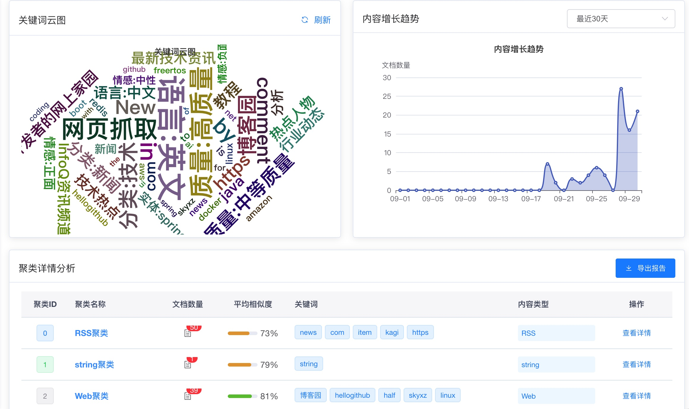

## 功能要求

1. 实现定时任务机制，通过 RSS、网页抓取及智能代理工具获取新闻信息（需
   遵守网络爬虫规范与安全准则）

- 实现说明

```
 @Scheduled(fixedRate = 3600000) // 每隔1小时执行一次 (3600000毫秒)
    public void acquireRssData() {
        log.info("开始采集 RSS 数据...");
        int successCount = 0;  // 成功采集的条目数量
        int failureCount = 0;  // 失败的RSS源数量
```

```
 private static final List<String> WEB_URLS = List.of(
            "https://www.infoq.cn/news",    // InfoQ 资讯频道
            "https://www.cnblogs.com/"      // 博客园首页
    );
```

2. 基于 Ollama 部署大模型，推荐采用 qwen2.5::3b 模型。

- 实现说明
  基于 openai 的 api 实现，模型使用 GPT-3.5-turbo"

3. 构建本地知识库系统，配置嵌入模型（推荐使用 all-MiniLM-L6-v2）、重排模型
   （推荐使用 ms-marco-MiniLM-L-6-v2）及大语言模型

- 实现说明
  嵌入模型 all-MiniLM-L6-v2，向量维度：384 维
  重排模型 LLM 推理 GPT-3.5-turbo，通过大语言模型进行推理和优化

4. 通过 API 将抓取的信息写入知识库系统，支持结构化数据（可通过 Excel 整理）与非结构化数据类型。

- 实现说明
  通过 API 将抓取的信息写入知识库系统

5. 信息入库成功后，自动发送邮件提示（标题及内容自定义）。

- 实现说明
  信息入库成功后，通过 gmail 邮箱发送邮件。
  （测试环境在德国，163 不允许境外 ip 使用授权码，Hotmail 发送邮件失败）

6. 提供用户登录功能。

- 实现说明
  使用若以框架实现用户权限控制
  

7. 登录后支持知识库内容管理：查看数据列表（可按类型/时间筛选）、执行单
   条或批量删除操作、编辑元数据（如标签、来源），并支持通过页面上传多种类型
   数据至知识库。

- 实现说明
  
  
  
  

8. 登录后提供语义查询功能：基于用户提问优先检索知识库内容，结果按相似度
   AI 行前实战营培训考核项目排序返回。

- 实现说明
  
  
  

9. 若知识库未匹配到相关数据，自动触发联网查询（如调用百度搜索 API），返
   回前 3 条结果经大语言模型推理后输出。

- 实现说明

```
// 2. 判断是否需要联网查询
            boolean needWebSearch = shouldTriggerWebSearch(knowledgeResponse, request);
            List<WebSearchResultDto> webSearchResults = new ArrayList<>();
            long webSearchTime = 0L;
            log.info("needWebSearch: {}", needWebSearch);
            if (needWebSearch) {
                log.info("知识库检索结果不足，触发联网查询: query={}", request.getQuery());

                // 3. 执行联网查询
                long webSearchStart = System.currentTimeMillis();
                List<WebSearchService.WebSearchResult> webResults =
                    webSearchService.searchBaidu(request.getQuery(), 3);
```

10. 登录后提供知识库数据聚类分析报告，展示关键词 Top10 分布

- 实现说明
  
  

## 技术要求

1. 技术栈选型：前端采用 React 或 Vue 框架，后端采用 SpringBoot 或 Flask 框架，关系型数据库选用 MySQL 或 SQLite，向量数据库采用 FAISS。

- 实现说明
  技术栈选型：前端采用 Vue 框架，后端采用 SpringBoot 框架，关系型数据库选用 MySQL，向量数据库采用 FAISS。

2. 数据存储设计：元数据（如数据 ID、数据类型等）存储于关系型数据库，向量数据单独存储于 FAISS 向量数据库，实现数据分类管理与高效检索。

- 实现说明
  数据存储设计：元数据（如数据 ID、数据类型等）存储于关系型数据库，向量数据单独存储于 FAISS 向量数据库，实现数据分类管理与高效检索。

3. 框架集成：核心业务逻辑开发采用 LangChain 框架，支撑知识库构建与检索增强功能。

- 实现说明
  框架集成：核心业务逻辑开发采用 LangChain 框架，支撑知识库构建与检索增强功能。

4. 模型调用：通过标准化 API 接口实现与大模型服务的交互，确保服务调用的规范性与可扩展性。

- 实现说明
  模型调用：通过标准化 API 接口实现与大模型服务的交互，确保服务调用的规范性与可扩展性。

5. 身份认证：登录功能优先采用 Spring Security 框架或 JWT 技术方案，保障用户身份验证的安全性与可靠性。

- 实现说明
  身份认证：登录功能优先采用 Spring Security 框架，保障用户身份验证的安全性与可靠性。

## 其他要求

1. 项目资料提交要求：将本项目全部相关资料上传至 GitHub 仓库，仓库命名为“xu-ai-news-rag”。

- 实现说明
  GitHub 仓库，https://github.com/scott20050218/XU-News-AI-RAG/

2. 需提供产品需求文档（PRD）。

- 实现说明
  ./产品需求文档.md

3. 需提供概要设计文档与技术架构文档

- 实现说明
  ./设计文档.md

4. 需提供产品原型设计文件。

- 实现说明
  /prototype/my-app
  文档见：/prototype/my-app/README.md，/prototype/my-app/项目说明文档.md

5. 需提供前端与后端完整代码。

- 实现说明
  前端代码见：/mannagement/ruoyi-ui
  后端代码见：/backend/todo-backend,/backend/langchain, /mannagement

6. 需提供单元测试、集成测试及 API 测试相关代码。

- 实现说明
  /backend/todo-backend 下，mvn test
  /backend/langchain 下，mvn test

7. 若项目涉及关系型数据库操作，需提供对应的 SQL 语句。

- 实现说明
  /backend/todo-backend/src/main/resources/sql
  /mannagement/ruoyi-ui/src/main/resources/sql

8. 需提供项目说明文档（README.md），明确项目部署、运行及使用方式。

- 实现说明
  参考本 README.md 和各个工程下 README.md

9. 可选：准备项目介绍文档进行技术分享。

- 实现说明
  参考 log.md record.md
