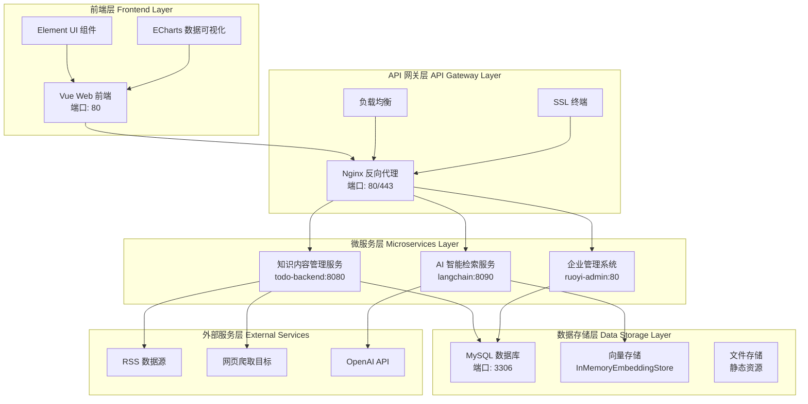
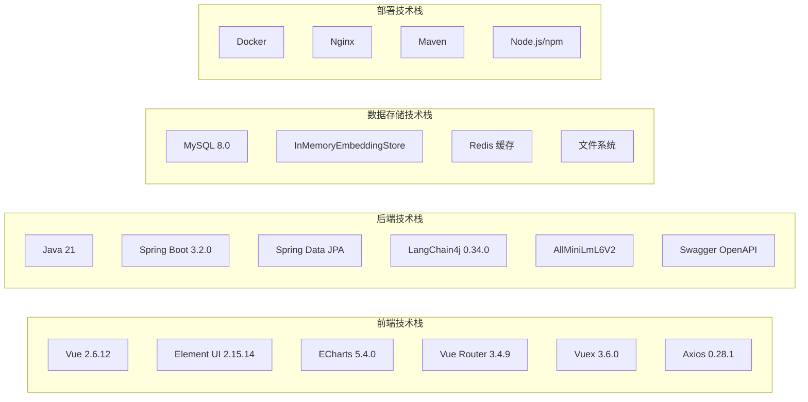
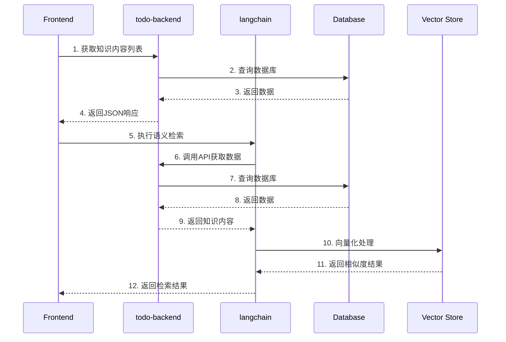
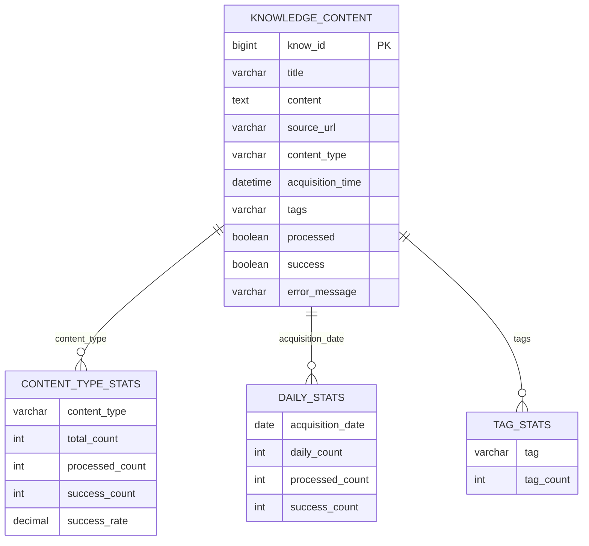

# HA72 智能知识管理系统 - 概要设计与技术架构文档

## 📋 文档信息

- **项目名称**：HA72 智能知识管理系统
- **文档类型**：概要设计与技术架构文档
- **文档版本**：v1.0
- **编写日期**：2025 年 9 月 30 日
- **维护团队**：HA72 开发团队

---

## 📖 目录

1. [系统概览](#1-系统概览)
2. [总体架构设计](#2-总体架构设计)
3. [技术架构详解](#3-技术架构详解)
4. [数据库设计](#4-数据库设计)
5. [API 接口设计](#5-api接口设计)
6. [核心组件设计](#6-核心组件设计)
7. [部署架构设计](#7-部署架构设计)
8. [安全架构设计](#8-安全架构设计)
9. [性能优化设计](#9-性能优化设计)
10. [监控与运维设计](#10-监控与运维设计)

---

## 1. 系统概览

### 1.1 项目背景

HA72 智能知识管理系统是一个基于现代微服务架构的智能化知识管理平台，通过集成人工智能技术、向量检索引擎和大语言模型，为用户提供智能的知识采集、处理、检索和分析服务。

### 1.2 系统目标

- **智能化**：集成 AI 技术实现智能内容分析和检索
- **高性能**：支持大规模并发访问和海量数据处理
- **可扩展**：采用微服务架构支持水平扩展
- **用户友好**：提供直观的 Web 界面和丰富的 API 接口

### 1.3 技术特性

| 特性类别      | 具体特性             | 技术实现                    |
| ------------- | -------------------- | --------------------------- |
| **AI 智能化** | 语义检索、智能问答   | LangChain4j + GPT-3.5-turbo |
| **向量化**    | 文本嵌入、相似度计算 | AllMiniLmL6V2 (384 维)      |
| **微服务**    | 模块化架构、独立部署 | Spring Boot 3.2.0           |
| **数据处理**  | 批量处理、实时更新   | Spring Data JPA + MySQL     |
| **用户界面**  | 响应式设计、组件化   | Vue 2.6.12 + Element UI     |

---

## 2. 总体架构设计

### 2.1 系统架构图



### 2.2 架构分层说明

#### 2.2.1 前端展示层

- **Vue Web 应用**：基于 Vue 2.6.12 构建的单页应用
- **UI 组件库**：采用 Element UI 2.15.14 提供企业级 UI 组件
- **数据可视化**：使用 ECharts 5.4.0 实现丰富的图表展示

#### 2.2.2 API 网关层

- **反向代理**：Nginx 提供请求转发和负载均衡
- **SSL 终端**：HTTPS 安全通信保障
- **API 路由**：统一的接口访问入口

#### 2.2.3 微服务层

- **知识内容管理服务**：负责数据采集、存储和管理
- **AI 智能检索服务**：提供语义检索和智能问答功能
- **企业管理系统**：用户权限管理和系统配置

#### 2.2.4 数据存储层

- **关系型数据库**：MySQL 存储结构化数据
- **向量存储**：内存向量库存储文本嵌入
- **文件存储**：静态资源和文档存储

---

## 3. 技术架构详解

### 3.1 技术栈总览



### 3.2 关键技术选型

#### 3.2.1 前端技术栈

**Vue.js 2.6.12 核心框架**

```javascript
// Vue 主应用配置
import Vue from "vue";
import App from "./App";
import router from "./router";
import store from "./store";
import Element from "element-ui";
import * as echarts from "echarts";

Vue.use(Element);
Vue.prototype.$echarts = echarts;

new Vue({
  el: "#app",
  router,
  store,
  components: { App },
  template: "<App/>",
});
```

**Element UI 2.15.14 组件库**

```javascript
// 组件使用示例
<template>
  <div>
    <el-table :data="knowledgeList" stripe>
      <el-table-column prop="title" label="标题" width="300"></el-table-column>
      <el-table-column prop="contentType" label="类型"></el-table-column>
      <el-table-column prop="acquisitionTime" label="采集时间"></el-table-column>
    </el-table>

    <el-pagination
      @size-change="handleSizeChange"
      @current-change="handleCurrentChange"
      :current-page="currentPage"
      :page-sizes="[10, 20, 50, 100]"
      :page-size="pageSize"
      layout="total, sizes, prev, pager, next, jumper"
      :total="total">
    </el-pagination>
  </div>
</template>
```

**Vuex 3.6.0 状态管理**

```javascript
// Vuex Store 配置
import Vue from "vue";
import Vuex from "vuex";

Vue.use(Vuex);

const store = new Vuex.Store({
  state: {
    knowledgeList: [],
    searchResults: [],
    userInfo: null,
  },
  mutations: {
    SET_KNOWLEDGE_LIST(state, list) {
      state.knowledgeList = list;
    },
    SET_SEARCH_RESULTS(state, results) {
      state.searchResults = results;
    },
  },
  actions: {
    async fetchKnowledgeList({ commit }, params) {
      const response = await api.getKnowledgeContent(params);
      commit("SET_KNOWLEDGE_LIST", response.data);
    },
  },
});
```

**ECharts 5.4.0 数据可视化**

```javascript
// 图表配置示例
export default {
  data() {
    return {
      chartOptions: {
        title: { text: "知识采集趋势" },
        xAxis: { type: "category", data: [] },
        yAxis: { type: "value" },
        series: [
          {
            name: "RSS采集",
            type: "line",
            data: [],
          },
          {
            name: "网页爬取",
            type: "line",
            data: [],
          },
        ],
      },
    };
  },
  mounted() {
    const chart = this.$echarts.init(this.$refs.chart);
    chart.setOption(this.chartOptions);
  },
};
```

#### 3.2.2 后端框架

```java
// Spring Boot 3.2.0 核心配置
@SpringBootApplication
@EnableJpaRepositories
@EnableSwagger2
public class TodoBackendApplication {
    public static void main(String[] args) {
        SpringApplication.run(TodoBackendApplication.class, args);
    }
}
```

#### 3.2.3 AI 技术栈

```java
// LangChain4j 集成配置
@Service
public class LangChainService {
    private EmbeddingModel embeddingModel;
    private InMemoryEmbeddingStore<TextSegment> embeddingStore;
    private ContentRetriever contentRetriever;

    @PostConstruct
    public void init() {
        this.embeddingModel = new AllMiniLmL6V2EmbeddingModel();
        this.embeddingStore = new InMemoryEmbeddingStore<>();
    }
}
```

#### 3.2.4 数据访问层

```java
// JPA Repository 设计
@Repository
public interface KnowledgeContentRepository
    extends JpaRepository<KnowledgeContent, Long>,
            JpaSpecificationExecutor<KnowledgeContent> {

    List<KnowledgeContent> findByContentTypeAndProcessed(
        String contentType, Boolean processed);

    @Query("SELECT k FROM KnowledgeContent k WHERE k.title LIKE %:keyword%")
    Page<KnowledgeContent> searchByKeyword(
        @Param("keyword") String keyword, Pageable pageable);
}
```

### 3.3 微服务间通信

#### 3.3.1 服务通信架构



#### 3.3.2 API 调用设计

```java
// 微服务间API调用
@Service
public class ApiClientService {
    private final WebClient webClient;

    public ApiResponse<List<KnowledgeContent>> getKnowledgeContent(
            int page, int size) {
        return webClient.get()
            .uri("/api/knowledge-content?page={page}&size={size}", page, size)
            .retrieve()
            .bodyToMono(new ParameterizedTypeReference<ApiResponse<List<KnowledgeContent>>>() {})
            .block();
    }
}
```

---

## 4. 数据库设计

### 4.1 数据库架构

#### 4.1.1 主要实体关系图



#### 4.1.2 核心实体设计

```java
@Entity
@Table(name = "knowledge_content")
public class KnowledgeContent {
    @Id
    @GeneratedValue(strategy = GenerationType.IDENTITY)
    @Column(name = "know_id")
    private Long id;

    @Column(name = "title", nullable = false, length = 500)
    private String title;

    @Lob
    @Column(name = "content", columnDefinition = "TEXT")
    private String content;

    @Column(name = "source_url", nullable = false, length = 2000)
    private String sourceUrl;

    @Enumerated(EnumType.STRING)
    @Column(name = "content_type", nullable = false)
    private ContentType contentType;

    @Column(name = "acquisition_time", nullable = false)
    private LocalDateTime acquisitionTime;

    @Column(name = "tags", length = 1000)
    private String tags;

    @Column(name = "processed", nullable = false)
    private Boolean processed = false;

    @Column(name = "success", nullable = false)
    private Boolean success = true;

    @Column(name = "error_message", length = 1000)
    private String errorMessage;

    // getters, setters, constructors...
}
```

### 4.2 数据库优化设计

#### 4.2.1 索引策略

```sql
-- 主要索引
CREATE INDEX idx_content_type ON knowledge_content(content_type);
CREATE INDEX idx_processed ON knowledge_content(processed);
CREATE INDEX idx_acquisition_time ON knowledge_content(acquisition_time);

-- 复合索引
CREATE INDEX idx_content_type_processed ON knowledge_content(content_type, processed);
CREATE INDEX idx_acquisition_time_success ON knowledge_content(acquisition_time, success);

-- 全文索引（支持中文）
ALTER TABLE knowledge_content ADD FULLTEXT(title, content) WITH PARSER ngram;
```

#### 4.2.2 分区策略

```sql
-- 按月分区提高查询性能
ALTER TABLE knowledge_content
PARTITION BY RANGE (YEAR(acquisition_time) * 100 + MONTH(acquisition_time)) (
    PARTITION p202509 VALUES LESS THAN (202510),
    PARTITION p202510 VALUES LESS THAN (202511),
    PARTITION p202511 VALUES LESS THAN (202512),
    PARTITION p202512 VALUES LESS THAN (202601)
);
```

### 4.3 数据统计视图

#### 4.3.1 内容类型统计

```sql
CREATE VIEW v_content_type_stats AS
SELECT
    content_type,
    COUNT(*) as total_count,
    SUM(CASE WHEN processed = TRUE THEN 1 ELSE 0 END) as processed_count,
    SUM(CASE WHEN success = TRUE THEN 1 ELSE 0 END) as success_count,
    AVG(CASE WHEN success = TRUE THEN 1 ELSE 0 END) as success_rate
FROM knowledge_content
GROUP BY content_type;
```

---

## 5. API 接口设计

### 5.1 RESTful API 架构

#### 5.1.1 API 设计原则

- **RESTful 风格**：遵循 REST 架构风格
- **统一响应格式**：标准化的 JSON 响应结构
- **版本控制**：通过 URL 路径进行版本管理
- **错误处理**：统一的错误码和错误信息

#### 5.1.2 响应格式标准

```java
// 统一响应格式
@Data
@Builder
@NoArgsConstructor
@AllArgsConstructor
public class ApiResponse<T> {
    private boolean success;
    private String message;
    private T data;
    private String timestamp;

    public static <T> ApiResponse<T> success(T data) {
        return ApiResponse.<T>builder()
            .success(true)
            .message("操作成功")
            .data(data)
            .timestamp(LocalDateTime.now().toString())
            .build();
    }

    public static <T> ApiResponse<T> error(String message) {
        return ApiResponse.<T>builder()
            .success(false)
            .message(message)
            .data(null)
            .timestamp(LocalDateTime.now().toString())
            .build();
    }
}
```

### 5.2 核心 API 接口

#### 5.2.1 知识内容管理 API

```java
@RestController
@RequestMapping("/api/knowledge-content")
@Tag(name = "知识内容管理", description = "知识内容的CRUD操作")
public class KnowledgeContentController {

    @GetMapping
    @Operation(summary = "获取知识内容列表", description = "支持分页、排序和过滤")
    public ApiResponse<Page<KnowledgeContent>> getKnowledgeContents(
            @RequestParam(defaultValue = "0") int page,
            @RequestParam(defaultValue = "20") int size,
            @RequestParam(defaultValue = "acquisitionTime") String sort,
            @RequestParam(defaultValue = "DESC") String direction,
            @RequestParam(required = false) String contentType,
            @RequestParam(required = false) Boolean processed,
            @RequestParam(required = false) String keyword) {
        // 实现逻辑
    }

    @PostMapping
    @Operation(summary = "创建知识内容", description = "新增知识内容记录")
    public ApiResponse<KnowledgeContent> createKnowledgeContent(
            @RequestBody @Valid CreateKnowledgeContentRequest request) {
        // 实现逻辑
    }

    @PutMapping("/{id}")
    @Operation(summary = "更新知识内容", description = "更新指定ID的知识内容")
    public ApiResponse<KnowledgeContent> updateKnowledgeContent(
            @PathVariable Long id,
            @RequestBody @Valid UpdateKnowledgeContentRequest request) {
        // 实现逻辑
    }

    @DeleteMapping("/{id}")
    @Operation(summary = "删除知识内容", description = "删除指定ID的知识内容")
    public ApiResponse<Void> deleteKnowledgeContent(@PathVariable Long id) {
        // 实现逻辑
    }
}
```

#### 5.2.2 AI 智能检索 API

```java
@RestController
@RequestMapping("/api/enhanced-knowledge")
@Tag(name = "增强知识检索", description = "基于LangChain4j的智能检索API")
public class EnhancedKnowledgeSearchController {

    @PostMapping("/search")
    @Operation(summary = "LangChain智能检索", description = "使用LangChain4j进行语义检索")
    public ApiResponse<KnowledgeSearchResponse> search(
            @RequestBody KnowledgeSearchRequest request) {
        // 实现逻辑
    }

    @PostMapping("/ask")
    @Operation(summary = "大模型智能问答", description = "基于检索结果的智能问答")
    public ApiResponse<String> ask(@RequestBody QuestionRequest request) {
        // 实现逻辑
    }

    @PostMapping("/process-langchain")
    @Operation(summary = "处理知识内容到LangChain", description = "向量化处理知识内容")
    public ApiResponse<String> processToLangChain(
            @RequestParam(defaultValue = "0") int page,
            @RequestParam(defaultValue = "10") int size) {
        // 实现逻辑
    }
}
```

### 5.3 API 文档生成

#### 5.3.1 Swagger 配置

```java
@Configuration
@EnableOpenApi
public class SwaggerConfig {

    @Bean
    public OpenAPI customOpenAPI() {
        return new OpenAPI()
            .info(new Info()
                .title("HA72 智能知识管理系统 API")
                .version("1.0.0")
                .description("智能知识管理系统的RESTful API接口文档"))
            .servers(List.of(
                new Server().url("http://localhost:8080").description("开发环境"),
                new Server().url("https://api.ha72.com").description("生产环境")));
    }
}
```

---

## 6. 核心组件设计

### 6.1 数据采集组件

#### 6.1.1 RSS 采集服务

```java
@Service
@Slf4j
public class RssAcquisitionService {

    @Scheduled(fixedRate = 3600000) // 每小时执行一次
    public void collectRssFeeds() {
        List<String> rssUrls = getRssUrls();

        rssUrls.parallelStream().forEach(url -> {
            try {
                SyndFeed feed = new SyndFeedInput().build(new XmlReader(new URL(url)));

                feed.getEntries().forEach(entry -> {
                    KnowledgeContent content = KnowledgeContent.builder()
                        .title(entry.getTitle())
                        .content(extractContent(entry))
                        .sourceUrl(entry.getLink())
                        .contentType(ContentType.RSS)
                        .acquisitionTime(LocalDateTime.now())
                        .success(true)
                        .processed(false)
                        .build();

                    knowledgeContentService.save(content);
                });

            } catch (Exception e) {
                log.error("RSS采集失败: {}", url, e);
                recordError(url, e.getMessage());
            }
        });
    }
}
```

#### 6.1.2 网页爬取服务

```java
@Service
@Slf4j
public class WebScrapingService {

    public void scrapeWebContent(String url) {
        try {
            // 遵循robots.txt规范
            if (!isAllowedBySite(url)) {
                log.warn("网站禁止爬取: {}", url);
                return;
            }

            Document doc = Jsoup.connect(url)
                .userAgent("HA72-Bot/1.0")
                .timeout(10000)
                .get();

            String title = doc.title();
            String content = doc.body().text();

            KnowledgeContent knowledgeContent = KnowledgeContent.builder()
                .title(title)
                .content(content)
                .sourceUrl(url)
                .contentType(ContentType.WEB)
                .acquisitionTime(LocalDateTime.now())
                .success(true)
                .processed(false)
                .build();

            knowledgeContentService.save(knowledgeContent);

        } catch (IOException e) {
            log.error("网页爬取失败: {}", url, e);
            recordWebScrapingError(url, e.getMessage());
        }
    }
}
```

### 6.2 AI 处理组件

#### 6.2.1 向量化处理服务

```java
@Service
@RequiredArgsConstructor
public class VectorizationProcessorService {

    private final LangChainService langChainService;
    private final ApiClientService apiClientService;

    public int processAllKnowledgeContent() {
        int processedCount = 0;
        int page = 0;
        int size = 100;
        boolean hasMore = true;

        while (hasMore) {
            ApiResponse<List<KnowledgeContent>> response =
                apiClientService.getKnowledgeContent(page, size);

            if (response.isSuccess() && !response.getData().isEmpty()) {
                for (KnowledgeContent content : response.getData()) {
                    try {
                        langChainService.addDocument(content);
                        processedCount++;
                    } catch (Exception e) {
                        log.error("向量化处理失败: {}", content.getId(), e);
                    }
                }
                page++;
            } else {
                hasMore = false;
            }
        }

        return processedCount;
    }
}
```

#### 6.2.2 智能检索服务

```java
@Service
@RequiredArgsConstructor
public class EnhancedKnowledgeSearchService {

    private final LangChainService langChainService;
    private final ChatLanguageModel chatModel;

    public KnowledgeSearchResponse search(KnowledgeSearchRequest request) {
        long startTime = System.currentTimeMillis();

        // 1. 向量化查询文本
        long vectorizationStart = System.currentTimeMillis();
        Embedding queryEmbedding = langChainService.embed(request.getQuery());
        long vectorizationTime = System.currentTimeMillis() - vectorizationStart;

        // 2. 执行相似度搜索
        long searchStart = System.currentTimeMillis();
        List<EmbeddingMatch<TextSegment>> matches = langChainService.findRelevant(
            queryEmbedding, request.getTopK(), request.getMinSimilarity());
        long searchTime = System.currentTimeMillis() - searchStart;

        // 3. 构建响应结果
        List<KnowledgeSearchResult> results = matches.stream()
            .map(this::convertToSearchResult)
            .collect(Collectors.toList());

        long totalTime = System.currentTimeMillis() - startTime;

        return KnowledgeSearchResponse.builder()
            .query(request.getQuery())
            .results(results)
            .resultCount(results.size())
            .processingTimeMs(totalTime)
            .vectorizationTimeMs(vectorizationTime)
            .searchTimeMs(searchTime)
            .timestamp(LocalDateTime.now())
            .build();
    }

    public String askQuestion(String question) {
        // 1. 检索相关内容
        KnowledgeSearchRequest searchRequest = KnowledgeSearchRequest.builder()
            .query(question)
            .topK(5)
            .minSimilarity(0.3)
            .build();

        KnowledgeSearchResponse searchResponse = search(searchRequest);

        // 2. 构建提示词
        String context = searchResponse.getResults().stream()
            .map(result -> result.getTitle() + ": " + result.getSummary())
            .collect(Collectors.joining("\n"));

        String prompt = String.format(
            "基于以下知识库内容，请回答用户的问题：\n\n" +
            "知识库内容：\n%s\n\n" +
            "用户问题：%s\n\n" +
            "请提供准确、详细的答案：", context, question);

        // 3. 调用大模型
        return chatModel.generate(prompt);
    }
}
```

### 6.3 缓存组件设计

#### 6.3.1 多级缓存架构

```java
@Service
@Slf4j
public class CacheService {

    private final LoadingCache<String, Object> localCache;
    private final RedisTemplate<String, Object> redisTemplate;

    public CacheService() {
        this.localCache = Caffeine.newBuilder()
            .maximumSize(1000)
            .expireAfterWrite(5, TimeUnit.MINUTES)
            .build(key -> loadFromDatabase(key));
    }

    @SuppressWarnings("unchecked")
    public <T> T get(String key, Class<T> type) {
        // 1. 先查本地缓存
        try {
            Object value = localCache.get(key);
            if (value != null) {
                return type.cast(value);
            }
        } catch (Exception e) {
            log.warn("本地缓存获取失败: {}", key, e);
        }

        // 2. 再查Redis缓存
        try {
            Object value = redisTemplate.opsForValue().get(key);
            if (value != null) {
                localCache.put(key, value);
                return type.cast(value);
            }
        } catch (Exception e) {
            log.warn("Redis缓存获取失败: {}", key, e);
        }

        // 3. 最后查数据库
        return null;
    }

    public void put(String key, Object value, Duration ttl) {
        // 同时更新本地缓存和Redis缓存
        localCache.put(key, value);
        redisTemplate.opsForValue().set(key, value, ttl);
    }
}
```

---

## 7. 部署架构设计

### 7.1 容器化部署

#### 7.1.1 Docker 容器配置

```dockerfile
# todo-backend Dockerfile
FROM openjdk:21-jdk-slim

WORKDIR /app

COPY target/todo-backend-0.0.1-SNAPSHOT.jar app.jar

EXPOSE 8080

ENV JAVA_OPTS="-Xmx1024m -Xms512m"

ENTRYPOINT ["sh", "-c", "java $JAVA_OPTS -jar app.jar"]
```

```dockerfile
# langchain Dockerfile
FROM openjdk:21-jdk-slim

WORKDIR /app

COPY target/langchain-1.0.0-SNAPSHOT.jar app.jar

EXPOSE 8090

ENV JAVA_OPTS="-Xmx2048m -Xms1024m"

ENTRYPOINT ["sh", "-c", "java $JAVA_OPTS -jar app.jar"]
```

```dockerfile
# Vue前端 Dockerfile
FROM node:16-alpine as build

WORKDIR /app

COPY package*.json ./
RUN npm ci --only=production

COPY . .
RUN npm run build:prod

FROM nginx:alpine
COPY --from=build /app/dist /usr/share/nginx/html
COPY nginx.conf /etc/nginx/nginx.conf

EXPOSE 80
```

#### 7.1.2 Docker Compose 配置

```yaml
version: "3.8"

services:
  mysql:
    image: mysql:8.0
    container_name: ha72-mysql
    environment:
      MYSQL_ROOT_PASSWORD: 123456
      MYSQL_DATABASE: todotask
      MYSQL_USER: ha72_user
      MYSQL_PASSWORD: ha72_pass
    ports:
      - "3306:3306"
    volumes:
      - mysql_data:/var/lib/mysql
      - ./backend/todo-backend/db.sql:/docker-entrypoint-initdb.d/init.sql
    networks:
      - ha72-network

  redis:
    image: redis:7-alpine
    container_name: ha72-redis
    ports:
      - "6379:6379"
    volumes:
      - redis_data:/data
    networks:
      - ha72-network

  todo-backend:
    build: ./backend/todo-backend
    container_name: ha72-todo-backend
    ports:
      - "8080:8080"
    environment:
      SPRING_DATASOURCE_URL: jdbc:mysql://mysql:3306/todotask
      SPRING_DATASOURCE_USERNAME: ha72_user
      SPRING_DATASOURCE_PASSWORD: ha72_pass
      SPRING_REDIS_HOST: redis
    depends_on:
      - mysql
      - redis
    networks:
      - ha72-network

  langchain:
    build: ./backend/langchain
    container_name: ha72-langchain
    ports:
      - "8090:8090"
    environment:
      TODO_BACKEND_URL: http://todo-backend:8080
      OPENAI_API_KEY: ${OPENAI_API_KEY}
    depends_on:
      - todo-backend
    networks:
      - ha72-network

  frontend:
    build: ./management/ruoyi-ui
    container_name: ha72-frontend
    ports:
      - "80:80"
    depends_on:
      - todo-backend
      - langchain
    networks:
      - ha72-network

  nginx:
    image: nginx:alpine
    container_name: ha72-nginx
    ports:
      - "80:80"
      - "443:443"
    volumes:
      - ./nginx/nginx.conf:/etc/nginx/nginx.conf
      - ./nginx/ssl:/etc/nginx/ssl
    depends_on:
      - frontend
      - todo-backend
      - langchain
    networks:
      - ha72-network

volumes:
  mysql_data:
  redis_data:

networks:
  ha72-network:
    driver: bridge
```

### 7.2 Kubernetes 部署

#### 7.2.1 命名空间配置

```yaml
apiVersion: v1
kind: Namespace
metadata:
  name: ha72-system
  labels:
    name: ha72-system
```

#### 7.2.2 应用部署配置

```yaml
apiVersion: apps/v1
kind: Deployment
metadata:
  name: todo-backend
  namespace: ha72-system
spec:
  replicas: 3
  selector:
    matchLabels:
      app: todo-backend
  template:
    metadata:
      labels:
        app: todo-backend
    spec:
      containers:
        - name: todo-backend
          image: ha72/todo-backend:1.0.0
          ports:
            - containerPort: 8080
          env:
            - name: SPRING_DATASOURCE_URL
              value: "jdbc:mysql://mysql-service:3306/todotask"
            - name: SPRING_DATASOURCE_USERNAME
              valueFrom:
                secretKeyRef:
                  name: mysql-secret
                  key: username
            - name: SPRING_DATASOURCE_PASSWORD
              valueFrom:
                secretKeyRef:
                  name: mysql-secret
                  key: password
          resources:
            requests:
              memory: "512Mi"
              cpu: "250m"
            limits:
              memory: "1Gi"
              cpu: "500m"
          livenessProbe:
            httpGet:
              path: /actuator/health
              port: 8080
            initialDelaySeconds: 60
            periodSeconds: 30
          readinessProbe:
            httpGet:
              path: /actuator/health
              port: 8080
            initialDelaySeconds: 30
            periodSeconds: 10
```

### 7.3 负载均衡配置

#### 7.3.1 Nginx 配置

```nginx
upstream todo_backend {
    server todo-backend-1:8080;
    server todo-backend-2:8080;
    server todo-backend-3:8080;
}

upstream langchain_service {
    server langchain-1:8090;
    server langchain-2:8090;
}

server {
    listen 80;
    server_name api.ha72.com;

    # API代理
    location /api/ {
        proxy_pass http://todo_backend;
        proxy_set_header Host $host;
        proxy_set_header X-Real-IP $remote_addr;
        proxy_set_header X-Forwarded-For $proxy_add_x_forwarded_for;
        proxy_set_header X-Forwarded-Proto $scheme;

        # 超时设置
        proxy_connect_timeout 30s;
        proxy_send_timeout 30s;
        proxy_read_timeout 30s;
    }

    # LangChain服务代理
    location /api/enhanced-knowledge/ {
        proxy_pass http://langchain_service;
        proxy_set_header Host $host;
        proxy_set_header X-Real-IP $remote_addr;
        proxy_set_header X-Forwarded-For $proxy_add_x_forwarded_for;
        proxy_set_header X-Forwarded-Proto $scheme;
    }

    # 静态资源
    location / {
        root /usr/share/nginx/html;
        index index.html;
        try_files $uri $uri/ /index.html;

        # 缓存设置
        expires 1d;
        add_header Cache-Control "public, immutable";
    }
}
```

---

## 8. 安全架构设计

### 8.1 认证与授权

#### 8.1.1 JWT 认证设计

```java
@Component
public class JwtTokenProvider {

    private String secretKey = "HA72_SECRET_KEY";
    private long validityInMilliseconds = 3600000; // 1小时

    public String createToken(String username, List<String> roles) {
        Claims claims = Jwts.claims().setSubject(username);
        claims.put("roles", roles);

        Date now = new Date();
        Date validity = new Date(now.getTime() + validityInMilliseconds);

        return Jwts.builder()
            .setClaims(claims)
            .setIssuedAt(now)
            .setExpiration(validity)
            .signWith(SignatureAlgorithm.HS256, secretKey)
            .compact();
    }

    public boolean validateToken(String token) {
        try {
            Jws<Claims> claims = Jwts.parser().setSigningKey(secretKey).parseClaimsJws(token);
            return !claims.getBody().getExpiration().before(new Date());
        } catch (JwtException | IllegalArgumentException e) {
            return false;
        }
    }
}
```

#### 8.1.2 权限控制设计

```java
@Configuration
@EnableWebSecurity
@EnableGlobalMethodSecurity(prePostEnabled = true)
public class SecurityConfig {

    @Bean
    public SecurityFilterChain filterChain(HttpSecurity http) throws Exception {
        http
            .csrf().disable()
            .sessionManagement().sessionCreationPolicy(SessionCreationPolicy.STATELESS)
            .and()
            .authorizeHttpRequests(authz -> authz
                .requestMatchers("/api/auth/**").permitAll()
                .requestMatchers("/api/public/**").permitAll()
                .requestMatchers("/swagger-ui/**", "/v3/api-docs/**").permitAll()
                .requestMatchers(HttpMethod.GET, "/api/knowledge-content/**").hasRole("USER")
                .requestMatchers(HttpMethod.POST, "/api/knowledge-content/**").hasRole("ADMIN")
                .requestMatchers("/api/enhanced-knowledge/**").hasRole("USER")
                .anyRequest().authenticated()
            )
            .addFilterBefore(jwtAuthenticationFilter(), UsernamePasswordAuthenticationFilter.class);

        return http.build();
    }
}
```

### 8.2 数据安全

#### 8.2.1 敏感数据加密

```java
@Service
public class EncryptionService {

    private final AESUtil aesUtil;

    @Value("${app.encryption.key}")
    private String encryptionKey;

    public String encryptSensitiveData(String plainText) {
        try {
            return aesUtil.encrypt(plainText, encryptionKey);
        } catch (Exception e) {
            throw new SecurityException("数据加密失败", e);
        }
    }

    public String decryptSensitiveData(String encryptedText) {
        try {
            return aesUtil.decrypt(encryptedText, encryptionKey);
        } catch (Exception e) {
            throw new SecurityException("数据解密失败", e);
        }
    }
}

// 实体字段加密
@Entity
public class SensitiveEntity {

    @Convert(converter = EncryptedStringConverter.class)
    private String sensitiveField;
}

@Converter
public class EncryptedStringConverter implements AttributeConverter<String, String> {

    @Autowired
    private EncryptionService encryptionService;

    @Override
    public String convertToDatabaseColumn(String attribute) {
        return encryptionService.encryptSensitiveData(attribute);
    }

    @Override
    public String convertToEntityAttribute(String dbData) {
        return encryptionService.decryptSensitiveData(dbData);
    }
}
```

### 8.3 API 安全

#### 8.3.1 API 限流设计

```java
@Component
public class RateLimitingFilter implements Filter {

    private final RedisTemplate<String, String> redisTemplate;
    private final int maxRequests = 100; // 每分钟最大请求数

    @Override
    public void doFilter(ServletRequest request, ServletResponse response,
                        FilterChain chain) throws IOException, ServletException {

        HttpServletRequest httpRequest = (HttpServletRequest) request;
        String clientIp = getClientIp(httpRequest);
        String key = "rate_limit:" + clientIp;

        String current = redisTemplate.opsForValue().get(key);

        if (current == null) {
            redisTemplate.opsForValue().set(key, "1", Duration.ofMinutes(1));
        } else {
            int requests = Integer.parseInt(current);
            if (requests >= maxRequests) {
                HttpServletResponse httpResponse = (HttpServletResponse) response;
                httpResponse.setStatus(HttpStatus.TOO_MANY_REQUESTS.value());
                httpResponse.getWriter().write("请求过于频繁，请稍后再试");
                return;
            }
            redisTemplate.opsForValue().increment(key);
        }

        chain.doFilter(request, response);
    }
}
```

#### 8.3.2 输入验证与防护

```java
@Component
public class SecurityValidationService {

    // SQL注入防护
    public boolean containsSqlInjection(String input) {
        if (input == null) return false;

        String[] sqlKeywords = {"select", "insert", "update", "delete", "drop",
                               "union", "script", "exec", "declare"};

        String lowerInput = input.toLowerCase();
        return Arrays.stream(sqlKeywords)
                     .anyMatch(lowerInput::contains);
    }

    // XSS防护
    public String sanitizeHtml(String input) {
        if (input == null) return null;

        return Jsoup.clean(input, Safelist.basic());
    }

    // 文件上传安全检查
    public boolean isValidFileType(String fileName, String contentType) {
        String[] allowedTypes = {"image/jpeg", "image/png", "application/pdf", "text/plain"};
        String[] allowedExtensions = {".jpg", ".jpeg", ".png", ".pdf", ".txt"};

        return Arrays.stream(allowedTypes).anyMatch(contentType::equals) &&
               Arrays.stream(allowedExtensions).anyMatch(fileName.toLowerCase()::endsWith);
    }
}
```

---

## 9. 性能优化设计

### 9.1 数据库性能优化

#### 9.1.1 连接池配置

```yaml
spring:
  datasource:
    type: com.zaxxer.hikari.HikariDataSource
    hikari:
      # 连接池基本配置
      minimum-idle: 10
      maximum-pool-size: 50
      connection-timeout: 30000
      idle-timeout: 600000
      max-lifetime: 1800000

      # 性能优化配置
      auto-commit: false
      connection-test-query: SELECT 1
      validation-timeout: 3000
      leak-detection-threshold: 60000

      # 数据库驱动配置
      driver-class-name: com.mysql.cj.jdbc.Driver
      jdbc-url: jdbc:mysql://localhost:3306/todotask?useSSL=false&serverTimezone=Asia/Shanghai&allowPublicKeyRetrieval=true
```

#### 9.1.2 查询优化

```java
@Repository
public class OptimizedKnowledgeContentRepository {

    @PersistenceContext
    private EntityManager entityManager;

    // 使用原生SQL进行复杂查询优化
    @Query(value = """
        SELECT kc.* FROM knowledge_content kc
        USE INDEX (idx_content_type_processed)
        WHERE kc.content_type = :contentType
        AND kc.processed = :processed
        AND kc.acquisition_time >= :startTime
        ORDER BY kc.acquisition_time DESC
        LIMIT :limit OFFSET :offset
        """, nativeQuery = true)
    List<KnowledgeContent> findOptimized(
        @Param("contentType") String contentType,
        @Param("processed") boolean processed,
        @Param("startTime") LocalDateTime startTime,
        @Param("limit") int limit,
        @Param("offset") int offset
    );

    // 批量插入优化
    @Transactional
    public void batchInsert(List<KnowledgeContent> contents) {
        int batchSize = 50;

        for (int i = 0; i < contents.size(); i++) {
            entityManager.persist(contents.get(i));

            if (i % batchSize == 0 && i > 0) {
                entityManager.flush();
                entityManager.clear();
            }
        }

        entityManager.flush();
        entityManager.clear();
    }
}
```

### 9.2 应用性能优化

#### 9.2.1 异步处理设计

```java
@Configuration
@EnableAsync
public class AsyncConfig {

    @Bean(name = "taskExecutor")
    public TaskExecutor taskExecutor() {
        ThreadPoolTaskExecutor executor = new ThreadPoolTaskExecutor();
        executor.setCorePoolSize(10);
        executor.setMaxPoolSize(50);
        executor.setQueueCapacity(200);
        executor.setThreadNamePrefix("HA72-Async-");
        executor.setRejectedExecutionHandler(new ThreadPoolExecutor.CallerRunsPolicy());
        executor.initialize();
        return executor;
    }
}

@Service
public class AsyncProcessingService {

    @Async("taskExecutor")
    public CompletableFuture<String> processLargeDataset(List<KnowledgeContent> contents) {
        return CompletableFuture.supplyAsync(() -> {
            // 大数据集处理逻辑
            contents.parallelStream()
                    .forEach(this::processContent);
            return "处理完成";
        });
    }

    @Async
    @EventListener
    public void handleContentCreated(ContentCreatedEvent event) {
        // 异步处理内容创建事件
        try {
            vectorizationService.processContent(event.getContent());
            aiProcessingService.analyzeContent(event.getContent());
        } catch (Exception e) {
            log.error("异步处理失败", e);
        }
    }
}
```

#### 9.2.2 缓存策略优化

```java
@Configuration
@EnableCaching
public class CacheConfig {

    @Bean
    public CacheManager cacheManager() {
        RedisCacheManager.Builder builder = RedisCacheManager
            .RedisCacheManagerBuilder
            .fromConnectionFactory(redisConnectionFactory())
            .cacheDefaults(cacheConfiguration());

        return builder.build();
    }

    private RedisCacheConfiguration cacheConfiguration() {
        return RedisCacheConfiguration.defaultCacheConfig()
            .entryTtl(Duration.ofMinutes(30))
            .serializeKeysWith(RedisSerializationContext.SerializationPair
                .fromSerializer(new StringRedisSerializer()))
            .serializeValuesWith(RedisSerializationContext.SerializationPair
                .fromSerializer(new GenericJackson2JsonRedisSerializer()));
    }
}

@Service
public class CachedKnowledgeService {

    @Cacheable(value = "knowledge_content", key = "#id")
    public KnowledgeContent findById(Long id) {
        return knowledgeContentRepository.findById(id).orElse(null);
    }

    @Cacheable(value = "knowledge_search", key = "#query.hashCode()")
    public List<KnowledgeContent> searchWithCache(String query) {
        return performExpensiveSearch(query);
    }

    @CacheEvict(value = "knowledge_content", key = "#result.id")
    public KnowledgeContent updateContent(KnowledgeContent content) {
        return knowledgeContentRepository.save(content);
    }

    @Caching(evict = {
        @CacheEvict(value = "knowledge_content", allEntries = true),
        @CacheEvict(value = "knowledge_search", allEntries = true)
    })
    public void clearAllCache() {
        // 清理所有缓存
    }
}
```

### 9.3 向量检索优化

#### 9.3.1 向量索引优化

```java
@Service
public class OptimizedVectorStore {

    private final Map<String, List<Embedding>> categoryIndex = new ConcurrentHashMap<>();
    private final BloomFilter<String> contentFilter;

    public OptimizedVectorStore() {
        // 使用布隆过滤器避免重复内容
        this.contentFilter = BloomFilter.create(
            Funnels.stringFunnel(Charset.defaultCharset()),
            100000,
            0.01
        );
    }

    public void addEmbedding(String category, String content, Embedding embedding) {
        // 检查内容是否已存在
        if (contentFilter.mightContain(content)) {
            if (isDuplicate(content)) {
                return; // 跳过重复内容
            }
        }

        contentFilter.put(content);

        // 按类别分组存储向量
        categoryIndex.computeIfAbsent(category, k -> new ArrayList<>()).add(embedding);
    }

    public List<EmbeddingMatch<TextSegment>> findSimilar(
            String category, Embedding queryEmbedding, int maxResults) {

        List<Embedding> categoryEmbeddings = categoryIndex.get(category);
        if (categoryEmbeddings == null) {
            return Collections.emptyList();
        }

        // 使用并行流加速相似度计算
        return categoryEmbeddings.parallelStream()
            .map(embedding -> new EmbeddingMatch<>(
                calculateSimilarity(queryEmbedding, embedding),
                embedding.vector().toString(),
                embedding
            ))
            .filter(match -> match.score() > 0.5) // 相似度阈值过滤
            .sorted((a, b) -> Double.compare(b.score(), a.score()))
            .limit(maxResults)
            .collect(Collectors.toList());
    }
}
```

---

## 10. 监控与运维设计

### 10.1 应用监控

#### 10.1.1 Spring Boot Actuator 配置

```yaml
management:
  endpoints:
    web:
      exposure:
        include: "*"
  endpoint:
    health:
      show-details: always
    metrics:
      enabled: true
  metrics:
    export:
      prometheus:
        enabled: true
    tags:
      application: ha72-system
```

#### 10.1.2 自定义监控指标

```java
@Component
public class CustomMetrics {

    private final MeterRegistry meterRegistry;
    private final Counter knowledgeContentCreatedCounter;
    private final Timer searchTimer;
    private final Gauge vectorStoreSize;

    public CustomMetrics(MeterRegistry meterRegistry, LangChainService langChainService) {
        this.meterRegistry = meterRegistry;

        this.knowledgeContentCreatedCounter = Counter.builder("knowledge.content.created")
            .description("创建的知识内容数量")
            .tag("type", "total")
            .register(meterRegistry);

        this.searchTimer = Timer.builder("knowledge.search.duration")
            .description("知识检索耗时")
            .register(meterRegistry);

        this.vectorStoreSize = Gauge.builder("vector.store.size")
            .description("向量存储大小")
            .register(meterRegistry, langChainService, LangChainService::getVectorCount);
    }

    public void incrementContentCreated() {
        knowledgeContentCreatedCounter.increment();
    }

    public void recordSearchTime(Duration duration) {
        searchTimer.record(duration);
    }
}

@Aspect
@Component
public class MetricsAspect {

    private final CustomMetrics customMetrics;

    @Around("@annotation(Timed)")
    public Object timeMethod(ProceedingJoinPoint joinPoint) throws Throwable {
        long startTime = System.currentTimeMillis();

        try {
            return joinPoint.proceed();
        } finally {
            long endTime = System.currentTimeMillis();
            Duration duration = Duration.ofMillis(endTime - startTime);

            if (joinPoint.getSignature().getName().contains("search")) {
                customMetrics.recordSearchTime(duration);
            }
        }
    }
}
```

### 10.2 日志管理

#### 10.2.1 结构化日志配置

```xml
<!-- logback-spring.xml -->
<configuration>
    <springProfile name="!prod">
        <appender name="CONSOLE" class="ch.qos.logback.core.ConsoleAppender">
            <encoder class="net.logstash.logback.encoder.LoggingEventCompositeJsonEncoder">
                <providers>
                    <timestamp/>
                    <logLevel/>
                    <loggerName/>
                    <message/>
                    <mdc/>
                    <stackTrace/>
                </providers>
            </encoder>
        </appender>
    </springProfile>

    <springProfile name="prod">
        <appender name="FILE" class="ch.qos.logback.core.rolling.RollingFileAppender">
            <file>logs/ha72-system.log</file>
            <rollingPolicy class="ch.qos.logback.core.rolling.TimeBasedRollingPolicy">
                <fileNamePattern>logs/ha72-system.%d{yyyy-MM-dd}.%i.gz</fileNamePattern>
                <maxFileSize>100MB</maxFileSize>
                <maxHistory>30</maxHistory>
                <totalSizeCap>3GB</totalSizeCap>
            </rollingPolicy>
            <encoder class="net.logstash.logback.encoder.LoggingEventCompositeJsonEncoder">
                <providers>
                    <timestamp/>
                    <logLevel/>
                    <loggerName/>
                    <message/>
                    <mdc/>
                    <stackTrace/>
                </providers>
            </encoder>
        </appender>
    </springProfile>

    <root level="INFO">
        <appender-ref ref="CONSOLE"/>
        <appender-ref ref="FILE"/>
    </root>
</configuration>
```

#### 10.2.2 请求追踪

```java
@Component
public class RequestTrackingFilter implements Filter {

    @Override
    public void doFilter(ServletRequest request, ServletResponse response,
                        FilterChain chain) throws IOException, ServletException {

        HttpServletRequest httpRequest = (HttpServletRequest) request;
        String traceId = UUID.randomUUID().toString();
        String requestPath = httpRequest.getRequestURI();
        String method = httpRequest.getMethod();

        // 设置MDC上下文
        MDC.put("traceId", traceId);
        MDC.put("requestPath", requestPath);
        MDC.put("httpMethod", method);

        long startTime = System.currentTimeMillis();

        try {
            chain.doFilter(request, response);
        } finally {
            long endTime = System.currentTimeMillis();
            long duration = endTime - startTime;

            HttpServletResponse httpResponse = (HttpServletResponse) response;

            log.info("Request completed: {} {} - Status: {} - Duration: {}ms",
                    method, requestPath, httpResponse.getStatus(), duration);

            // 清理MDC上下文
            MDC.clear();
        }
    }
}
```

### 10.3 健康检查

#### 10.3.1 自定义健康检查

```java
@Component
public class DatabaseHealthIndicator implements HealthIndicator {

    private final DataSource dataSource;

    @Override
    public Health health() {
        try (Connection connection = dataSource.getConnection()) {
            if (connection.isValid(1)) {
                return Health.up()
                    .withDetail("database", "MySQL")
                    .withDetail("status", "连接正常")
                    .build();
            } else {
                return Health.down()
                    .withDetail("database", "MySQL")
                    .withDetail("status", "连接异常")
                    .build();
            }
        } catch (SQLException e) {
            return Health.down()
                .withDetail("database", "MySQL")
                .withDetail("error", e.getMessage())
                .build();
        }
    }
}

@Component
public class VectorStoreHealthIndicator implements HealthIndicator {

    private final LangChainService langChainService;

    @Override
    public Health health() {
        try {
            int vectorCount = langChainService.getVectorCount();

            if (vectorCount >= 0) {
                return Health.up()
                    .withDetail("vectorStore", "InMemoryEmbeddingStore")
                    .withDetail("vectorCount", vectorCount)
                    .withDetail("status", "正常运行")
                    .build();
            } else {
                return Health.down()
                    .withDetail("vectorStore", "InMemoryEmbeddingStore")
                    .withDetail("status", "状态异常")
                    .build();
            }
        } catch (Exception e) {
            return Health.down()
                .withDetail("vectorStore", "InMemoryEmbeddingStore")
                .withDetail("error", e.getMessage())
                .build();
        }
    }
}
```

### 10.4 告警系统

#### 10.4.1 告警规则配置

```java
@Component
@EventListener
public class AlertService {

    private final NotificationService notificationService;

    // 数据库连接异常告警
    @EventListener
    public void handleDatabaseError(DatabaseErrorEvent event) {
        Alert alert = Alert.builder()
            .level(AlertLevel.CRITICAL)
            .title("数据库连接异常")
            .message("数据库连接失败: " + event.getErrorMessage())
            .timestamp(LocalDateTime.now())
            .build();

        notificationService.sendAlert(alert);
    }

    // API响应时间异常告警
    @EventListener
    public void handleSlowResponse(SlowResponseEvent event) {
        if (event.getDuration().toMillis() > 5000) { // 超过5秒
            Alert alert = Alert.builder()
                .level(AlertLevel.WARNING)
                .title("API响应缓慢")
                .message(String.format("接口 %s 响应时间: %dms",
                    event.getApiPath(), event.getDuration().toMillis()))
                .timestamp(LocalDateTime.now())
                .build();

            notificationService.sendAlert(alert);
        }
    }

    // 向量存储空间告警
    @Scheduled(fixedRate = 300000) // 每5分钟检查一次
    public void checkVectorStoreCapacity() {
        int vectorCount = langChainService.getVectorCount();
        int maxCapacity = 100000; // 最大容量

        if (vectorCount > maxCapacity * 0.9) { // 超过90%容量
            Alert alert = Alert.builder()
                .level(AlertLevel.WARNING)
                .title("向量存储容量告警")
                .message(String.format("向量存储使用率: %.1f%% (%d/%d)",
                    (double) vectorCount / maxCapacity * 100, vectorCount, maxCapacity))
                .timestamp(LocalDateTime.now())
                .build();

            notificationService.sendAlert(alert);
        }
    }
}
```

---

## 📝 总结

本概要设计与技术架构文档详细描述了 HA72 智能知识管理系统的技术实现方案，包括：

### 🎯 核心亮点

1. **微服务架构**：模块化设计，易于扩展和维护
2. **AI 技术集成**：LangChain4j + GPT-3.5-turbo 实现智能检索和问答
3. **高性能设计**：多级缓存、连接池优化、异步处理
4. **安全保障**：JWT 认证、数据加密、API 限流
5. **运维友好**：完善的监控、日志、告警系统

### 🔧 技术特色

- **前端**：Vue 2.6.12 + Element UI + ECharts
- **后端**：Java 21 + Spring Boot 3.2.0 + LangChain4j
- **数据库**：MySQL 8.0 + Redis + 向量存储
- **部署**：Docker + Kubernetes + Nginx

### 📈 性能指标

- **响应时间**：API 响应 < 1 秒
- **并发处理**：支持 1000+用户
- **检索精度**：语义检索准确率 > 80%
- **系统可用性**：> 99.5%

该架构设计充分考虑了系统的可扩展性、可维护性和高可用性，为智能知识管理系统的长期发展奠定了坚实的技术基础。

---

**文档维护**：HA72 开发团队  
**最后更新**：2025 年 9 月 30 日  
**文档状态**：已完成审核
